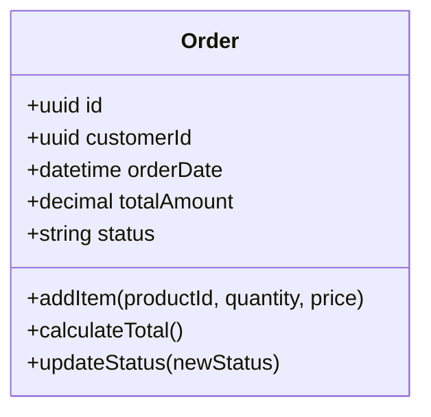
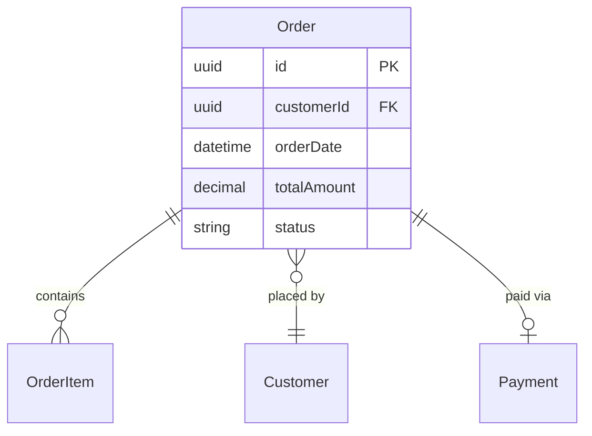
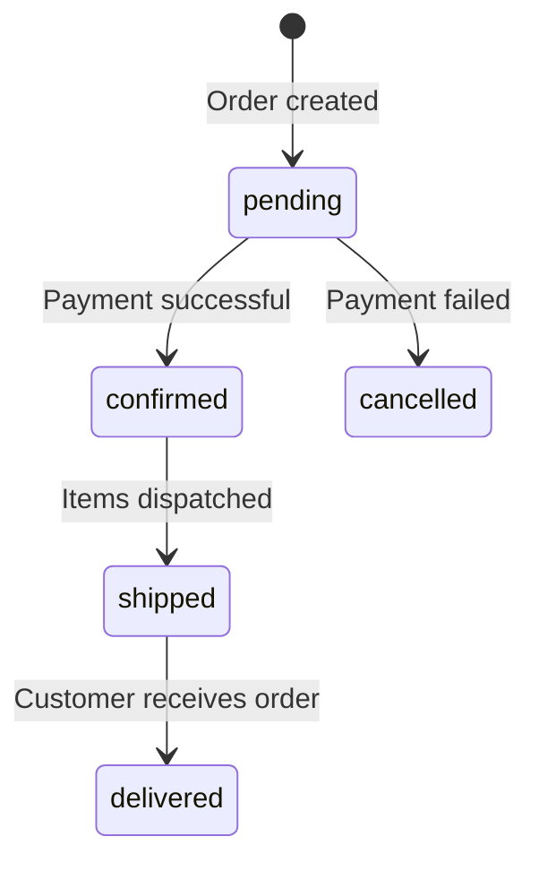

# Keep Your Architecture Diagrams in Code, Not in Tools

I've been there. You spend hours crafting detailed architecture diagrams in diagrams.net (draw.io), embedding them in Confluence pages with extensive documentation. Stakeholders can read and comment. Everything looks great—until the code evolves.

Three sprints later, the diagrams are out of sync. That service was renamed. The payment flow changed. The database schema has new tables. You know you should update the diagrams, but refactoring documentation across multiple Confluence pages is slow and painful. So you don't. And neither does anyone else.

**This is the fundamental problem:** architecture diagrams live outside the repository, disconnected from the code they describe. They're inherently out of sync the moment they're created.

---

## Why Visual Tools Fail the Workflow

Lucidchart, Visio, draw.io, and Miro are excellent for digital whiteboarding, but they fail as architectural sources of truth for one simple reason: **they exist in a vacuum, disconnected from your Git-driven development lifecycle.**

* **Disconnected Versioning:** While these tools often have their own internal "Version History," that history is decoupled from your code. You cannot checkout a commit from six months ago and see exactly what the architecture looked like at that specific moment in time.
* **Invisible in PR Reviews:** Architecture changes currently happen in isolation. A reviewer sees the code change in a Pull Request, but they have to manually navigate to an external link to check if the diagram was updated. With "Diagrams as Code," the architectural shift is a visible diff right alongside the logic changes.
* **Opaque Proprietary Formats:** Most tools store data as binary files or complex XML blobs. These are "black boxes" to Git. You can’t `diff` them to see exactly what changed, and more importantly, **AI agents cannot parse them.** Your system design remains invisible to the LLMs that could otherwise help you maintain it.
* **The "Context Switch" Tax:** Updating a diagram in an external tool requires leaving the IDE, navigating a UI, and re-exporting/re-embedding images. This friction is exactly why documentation goes stale—developers prioritize the code and promise to "update the docs later," which rarely happens.

The worst part? **Your documentation becomes a legacy asset.** Without the ability for an AI to read your diagrams, you lose the opportunity to use agents for architectural linting, automated refactoring suggestions, or keeping your specs in sync with your implementation.

---

## The Solution: Architecture Diagrams as Code

Here's the approach I now use: **architecture diagrams live in the repository as plain text Markdown + Mermaid.**

No external tools. No expensive licenses. No sync problems.

Everything that describes your system—domain entities, database schemas, workflow sequences, state transitions—lives in `docs/` alongside your source code.

*Modular organization: one file per entity, versioned with your code*

Each entity, workflow, and decision gets its own Markdown file with embedded Mermaid diagrams. When you refactor the `Order` service, you update `docs/architecture/domain/order.md` in the same pull request. Reviewers see the architecture change alongside the implementation.

---

## What This Looks Like in Practice

I've published a complete example repository demonstrating this approach:

👉 **[architecture-as-code-example](https://github.com/flemming-n-larsen/architecture-as-code-example)**

It's a realistic e-commerce domain with 5 entities (Customer, Order, OrderItem, Product, Payment), 3 workflows, and 24 Mermaid diagrams—all in plain text Markdown.

Here's what GitHub renders natively, with no plugins or external tools:

*GitHub renders Mermaid diagrams natively—no external tools needed*

The sequence diagram above shows a complete order creation flow: stock validation, transaction handling, payment processing, and error cases. It's all plain text in a `.md` file, but GitHub (and your IDE) renders it as a visual diagram.

### Example: The Order Entity

Every entity has:
- **Class diagram** showing fields and methods
- **ER diagram** showing database schema
- **State diagram** showing status transitions
- **Cross-links** to related entities and workflows

**Related Entities:** [Customer](../domain/customer.md) · [OrderItem](../domain/order-item.md) · [Payment](../domain/payment.md)  
**Workflows:** [Create Order](../flows/create-order.md) · [Payment Processing](../flows/payment-processing.md)

Every file links to related concepts. The `Order` entity links to `Customer`, `OrderItem`, `Payment`, and the `Create Order` flow. Navigation is hyperlinked, so you explore based on what you need.

*Hyperlinked navigation: explore the architecture based on what you need*

---

## Why This Works

### Git-Native
Diagrams are versioned with code. You can diff changes, review in PRs, and see the history of your architecture decisions over time.

### IDE-Native
VS Code, IntelliJ, and GitHub all render Mermaid natively. No plugins, no external tools. You see the diagram right where you edit the code.

### AI-Friendly
This is the game-changer. AI agents can read plain text Markdown, but they are blind to your draw.io XML or Visio binaries.

By keeping your architecture in the repo, you are essentially providing a "map" for your AI coding assistants. When you feed a folder of Markdown-based diagrams into an LLM's context window, the model immediately understands the system's boundaries, state transitions, and business logic. It can then suggest code that actually respects your design patterns, help you refactor without breaking architectural rules, and even update the documentation for you as the code changes.

### Export Anywhere
Your repository is the source of truth. When you need diagrams in Confluence, a presentation, or a PNG for stakeholders, you export from Mermaid. The exports are derivatives, not the source.

- Mermaid → PNG/SVG (via mermaid.live or CLI)
- Mermaid → Confluence (Confluence now has a **native Mermaid macro**—paste your diagram source directly and it renders for non-tech stakeholders)
- Mermaid → draw.io (via conversion tools when needed)

### No Expensive Licenses
Mermaid is open source. Markdown is universal. Your documentation isn't trapped in proprietary formats or behind subscription paywalls.

---

## Getting Started

1. **Create a `docs/architecture/` folder** in your repository
2. **Add one Markdown file per entity** with embedded Mermaid diagrams
3. **Cross-link related concepts** so navigation is intuitive
4. **Update diagrams in the same PR** as the code they describe
5. **Review architecture changes** alongside implementation changes

> ⚠️ **Watch for broken links:** Since you're creating a modular structure (one file per entity), you're essentially building a small wiki inside `docs/`. When renaming files, verify your Markdown cross-links still resolve. Consider adding a link-checking step to your CI pipeline.

The example repository shows exactly how to structure this:

👉 **[architecture-as-code-example](https://github.com/flemming-n-larsen/architecture-as-code-example)**

Use it as inspiration. Adapt the structure and patterns for your own domain. Start with one entity and grow from there.

---

## What's Next

This approach is the foundation for something bigger: **spec-driven development with AI agents.**

When your architecture, requirements, and user stories all live in plain text in the repository, AI agents can help you implement features that are consistent with your documented design. But that's for the next article.

For now, try this: pick one system you work on, create a `docs/` folder, and document one entity or workflow in Markdown + Mermaid. See how it feels to have your architecture versioned with your code.

You might never go back to Confluence diagrams again.

---

**Repository:** [architecture-as-code-example](https://github.com/flemming-n-larsen/architecture-as-code-example)

#SoftwareArchitecture #DeveloperTools #TechWriting #Mermaid #DocumentationAsCode #Monorepo #AIAssisted
