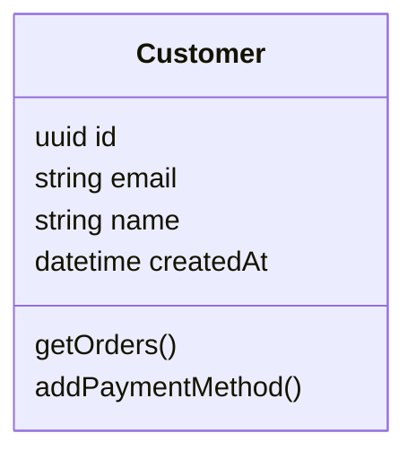
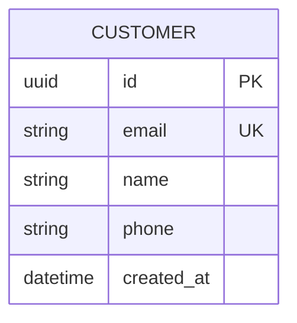
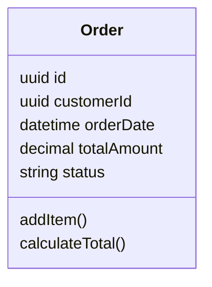
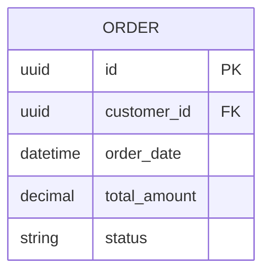
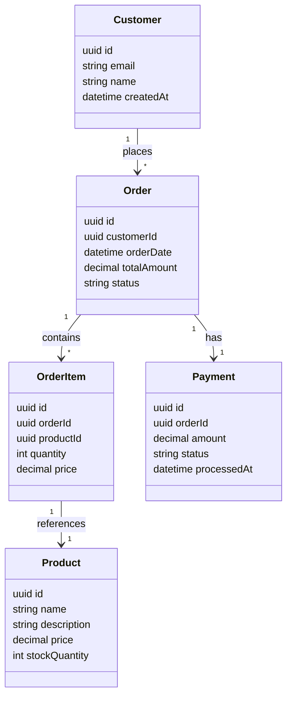
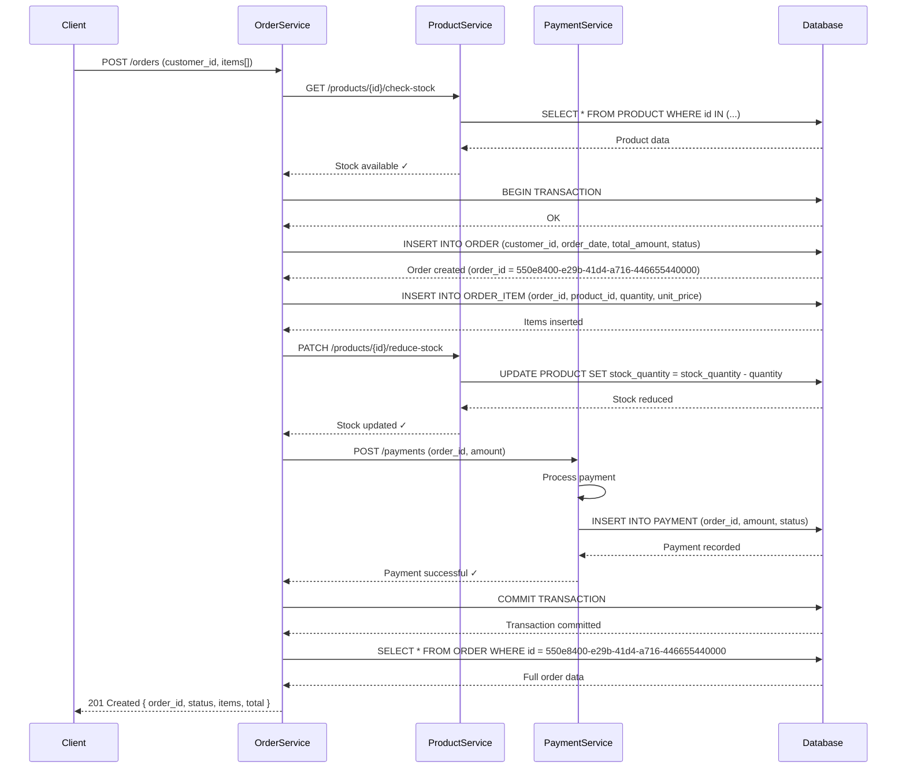

# Example Diagrams for Article Section 4

## Concrete Example: E-Commerce Microservice Architecture

This is a **simplified, imagined example** for educational purposes. Real-world systems would include additional
complexity (error handling, validation, caching, monitoring, etc.), but the core principles of keeping diagrams in code
remain the same.

This example demonstrates a **modular, document-driven architecture** where individual concepts are described in their own files, with diagrams embedded naturally alongside their descriptions.

---

## Repository Structure

```
docs/
├── architecture/
│   ├── README.md (overview + big picture diagram)
│   ├── domain/
│   │   ├── customer.md (Customer entity + individual class diagram)
│   │   ├── order.md (Order entity + diagram)
│   │   ├── product.md (Product entity + diagram)
│   │   └── payment.md (Payment entity + diagram)
│   └── flows/
│       └── create-order-flow.md (sequence diagram with explanation)
├── requirements.md (functional + non-functional requirements)
└── user-stories/
    ├── story-001-place-order.md
    └── story-002-manage-inventory.md
```

---

## Individual Entity Pages (Modular Approach)

### Example: `docs/architecture/domain/customer.md`

**Customer Entity**

A customer represents a user who can place orders. Each customer has a unique identity and payment methods.



**Fields:**
- `id` (uuid): Unique customer identifier
- `email` (string): Customer email (unique)
- `name` (string): Customer full name
- `createdAt` (datetime): Account creation timestamp

**Database Schema:**



---

### Example: `docs/architecture/domain/order.md`

**Order Entity**

An order represents a customer's purchase request. Orders track items, total amount, and payment status.



**Fields:**
- `id` (uuid): Unique order identifier
- `customerId` (uuid): Reference to Customer
- `orderDate` (datetime): When order was placed
- `totalAmount` (decimal): Sum of all items
- `status` (string): Order status (pending, confirmed, shipped, etc.)

**Database Schema:**



---

## The Big Picture (Overview Page)

### Example: `docs/architecture/README.md`

**System Architecture Overview**

This page brings all entities together to show how they interact.



See individual entity pages for detailed specifications:
- [Customer](domain/customer.md)
- [Order](domain/order.md)
- [Product](domain/product.md)
- [Payment](domain/payment.md)

---

## Workflow Diagrams

### Example: `docs/architecture/flows/create-order-flow.md`

**Create Order Request Flow**



---

## Key Benefits of This Approach

- **Modular**: Each concept/entity lives in its own file for clarity
- **DRY**: Diagrams are defined once, referenced from multiple places via links
- **Progressive disclosure**: Start with individual entities, then view relationships in the big picture
- **Maintainable**: Change one entity? Update its file, no need to refactor a massive architecture document
- **Scalable**: Add new entities/flows without cluttering existing documentation
- **Version controlled**: Each file can be reviewed, diffed, and tracked independently
- **AI-friendly**: Agents can help improve individual concepts without touching the entire architecture
- **Export ready**: Export individual pages or the big picture as needed (PNG/SVG/Confluence)

---

## How This Solves the Confluence Problem

**Old approach (Confluence + draw.io):**
- One massive document (or a page with many subpages) that you read **chronologically from top to bottom**
- All diagrams are embedded sequentially—to understand Payment, you must read through Customer, Order, OrderItem, Product first
- Change one entity? Update diagram, update doc, update relationships in the master diagram
- Refactoring is painful—multiple places to touch, and everything is interconnected
- Hard to review in pull requests (too much context)
- AI agents can't help efficiently
- **Problem:** Documentation structure mirrors the reading order, not the actual relationships

**New approach (Markdown + Mermaid in modular docs):**
- Multiple files organized hierarchically—**hyperlinked navigation based on what you actually need to understand**
- Reader can jump directly to Customer, Order, or Payment without reading prerequisites
- Each file is self-contained with its own diagram and context
- Change a Customer? Update `customer.md` and the reference in `README.md`—that's it
- Refactoring is localized—touch only what changed, isolated concerns
- PR reviews are focused: one file = one concept = one diagram
- AI agents can help improve individual files independently
- Cross-link via relative paths or index pages to maintain the DRY principle
- Aggregate views (big picture) are automatically consistent with individual pages
- **Benefit:** Documentation structure mirrors the actual relationships, and readers navigate based on **their needs, not a linear order**


