# Skeleton Files for GitHub Example Repository

This file contains template content for each file in the proposed `docs/` structure. Copy these templates to create your real GitHub example repository.

---

## docs/README.md

```markdown
# E-Commerce System Documentation

Welcome! This documentation describes the architecture, requirements, and user stories for our e-commerce platform.

## Quick Navigation

- **[Architecture Overview](architecture/)** — System design, entities, and workflows
  - [Domain Model](architecture/domain/) — Core business entities (Customer, Order, Product, Payment)
  - [Workflows](architecture/flows/) — How the system processes requests
  - [Decisions](architecture/decisions/) — Architecture Decision Records (ADRs)

- **[Requirements](requirements.md)** — Functional and non-functional requirements

- **[User Stories](user-stories/)** — Feature backlog and acceptance criteria

- **[API Documentation](api/)** — REST endpoints and specifications

## How to Use This Documentation

This documentation is **not meant to be read linearly**. Instead:

1. Start with [Architecture Overview](architecture/) for the big picture
2. Dive into specific [Domain Model](architecture/domain/) pages you're interested in
3. Navigate [Workflows](architecture/flows/) to understand how data flows through the system
4. Check [User Stories](user-stories/) for feature requirements
5. Use cross-links within each page to explore related concepts

## Key Principles

- 📝 **Everything in Code** — All diagrams live in Markdown as Mermaid, versioned with source code
- 🔗 **Hyperlinked** — Navigate based on what you need, not a linear reading order
- 🎯 **Modular** — One file per concept, self-contained but linked to related concepts
- ✏️ **Editable** — Change diagrams and documentation in pull requests alongside code changes
- 🤖 **AI-Friendly** — AI agents can help improve individual documentation files
- 📤 **Export Ready** — Convert to PNG/SVG/Confluence as needed

## Contributing

To update documentation:

1. Edit the relevant `.md` file in the `docs/` folder
2. Update embedded Mermaid diagrams directly in the file
3. Include changes in your pull request alongside code changes
4. Ensure all cross-links are correct
```

---

## docs/requirements.md

```markdown
# System Requirements

## Functional Requirements

### User Management
- FR-001: Users must be able to register with email and password
- FR-002: Users must be able to update their profile information
- FR-003: Users must be able to manage multiple payment methods

### Order Management
- FR-004: Customers must be able to place orders with multiple items
- FR-005: Customers must be able to view order history and status
- FR-006: System must support partial order fulfillment

### Payment Processing
- FR-007: System must validate payment information before processing
- FR-008: System must handle payment failures gracefully with retry logic
- FR-009: System must generate receipts for successful payments

### Inventory Management
- FR-010: System must track product stock levels
- FR-011: System must prevent overselling (concurrent order handling)
- FR-012: System must update inventory atomically with order confirmation

## Non-Functional Requirements

### Performance
- NFR-001: Order creation must complete within 2 seconds (p99)
- NFR-002: System must handle 1,000 concurrent users
- NFR-003: Payment processing must complete within 5 seconds

### Reliability
- NFR-004: System must have 99.9% uptime
- NFR-005: Database must support ACID transactions
- NFR-006: System must have automatic failover mechanisms

### Security
- NFR-007: All API endpoints must require authentication (JWT)
- NFR-008: Passwords must be hashed with bcrypt (cost factor ≥ 12)
- NFR-009: Payment data must comply with PCI-DSS
- NFR-010: All communications must use HTTPS

### Scalability
- NFR-011: System must support horizontal scaling (stateless services)
- NFR-012: Database must support read replicas for scaling read operations
- NFR-013: System must use distributed IDs (UUIDs) for cross-system compatibility

### Maintainability
- NFR-014: Code must have ≥ 80% test coverage
- NFR-015: Documentation must be updated with every architectural change
- NFR-016: All decisions must be recorded in Architecture Decision Records (ADRs)

## Constraints

- C-001: Must use PostgreSQL for persistent storage
- C-002: Must be deployable to Kubernetes
- C-003: Must support multi-region deployment for disaster recovery

## Assumptions

- A-001: Users have reliable internet connectivity
- A-002: Payment gateway (Stripe) is available 99.99% of the time
- A-002: Initial user base is < 100,000 active users (scale later)
```

---

## docs/architecture/README.md

```markdown
# System Architecture

## Overview

This system is an e-commerce platform built with microservices. The architecture follows domain-driven design principles and uses event-driven communication between services.

## System Architecture Diagram


## Domain Model

The core domain consists of five entities:

- **[Customer](domain/customer.md)** — Users who place orders
- **[Order](domain/order.md)** — Purchase requests with multiple items
- **[OrderItem](domain/order-item.md)** — Individual items in an order
- **[Product](domain/product.md)** — Items available for sale
- **[Payment](domain/payment.md)** — Payment information for orders

## Workflows

Key business processes:

- **[Create Order Flow](flows/create-order.md)** — How customers place orders
- **[Payment Processing Flow](flows/payment-processing.md)** — How payments are processed
- **[Inventory Management Flow](flows/inventory-management.md)** — How stock is tracked and updated

## Architecture Decisions

Important design decisions are recorded in [Architecture Decision Records](decisions/):

- [ADR-0001: Use UUIDs for Primary Keys](decisions/adr-0001-uuid-primary-keys.md)

## Quality Attributes

See [Requirements](../requirements.md) for detailed performance, reliability, security, and scalability requirements.
```

---

## docs/architecture/domain/customer.md

```markdown
# Customer Entity

The Customer entity represents a user who can place orders in the system.

## Business Logic

A customer:
- Has a unique identity (UUID)
- Can place multiple orders
- Can manage multiple payment methods
- Has contact information (email, name)
- Tracks creation timestamp for auditing

## Class Diagram


## Database Schema


## Fields

| Field | Type | Constraints | Description |
|-------|------|-------------|-------------|
| `id` | uuid | PK | Unique customer identifier |
| `email` | string | UNIQUE | Customer email address |
| `name` | string | NOT NULL | Customer full name |
| `phone` | string | NULLABLE | Customer phone number |
| `created_at` | datetime | NOT NULL | Account creation timestamp |

## Relationships

- Places [Orders](order.md) (1 customer : many orders)
- Has [Payments](payment.md) (indirectly through orders)

## Methods

- `getOrders()` — Retrieve all orders for this customer
- `addPaymentMethod()` — Register a new payment method

## Related Flows

- [Create Order Flow](../flows/create-order.md) — Uses Customer entity
```

---

## docs/architecture/domain/order.md

```markdown
# Order Entity

The Order entity represents a customer's purchase request.

## Business Logic

An order:
- Belongs to a single customer
- Contains multiple order items
- Has a total amount calculated from items
- Tracks order status (pending, confirmed, shipped, delivered)
- Is associated with a single payment
- Is created with a timestamp

## Class Diagram


## Database Schema


## Fields

| Field | Type | Constraints | Description |
|-------|------|-------------|-------------|
| `id` | uuid | PK | Unique order identifier |
| `customer_id` | uuid | FK | Reference to Customer |
| `order_date` | datetime | NOT NULL | When order was placed |
| `total_amount` | decimal | NOT NULL | Sum of all items |
| `status` | string | NOT NULL | Status: pending, confirmed, shipped, delivered |

## Status Values

- `pending` — Order placed, awaiting payment
- `confirmed` — Payment successful, preparing shipment
- `shipped` — Order sent to customer
- `delivered` — Order received by customer
- `cancelled` — Order cancelled

## Relationships

- Belongs to [Customer](customer.md) (many orders : 1 customer)
- Contains [OrderItems](order-item.md) (1 order : many items)
- Has [Payment](payment.md) (1 order : 1 payment)

## Methods

- `addItem(productId, quantity, price)` — Add item to order
- `calculateTotal()` — Recalculate total from items

## Related Flows

- [Create Order Flow](../flows/create-order.md) — Creates orders
```

---

## docs/architecture/flows/create-order.md

```markdown
# Create Order Flow

This flow describes how customers create orders in the system.

## Overview

When a customer places an order:
1. Client sends order request with customer ID and items
2. System validates customer and product stock
3. System creates order and items
4. System reduces product inventory atomically
5. System initiates payment processing
6. System returns order confirmation

## Sequence Diagram

```mermaid
sequenceDiagram
    participant Client
    participant OrderService
    participant ProductService
    participant PaymentService
    participant Database

    Client ->> OrderService: POST /orders (customer_id, items[])

    OrderService ->> ProductService: GET /products/{id}/check-stock
    ProductService ->> Database: SELECT * FROM PRODUCT WHERE id IN (...)
    Database -->> ProductService: Product data
    ProductService -->> OrderService: Stock available ✓

    OrderService ->> Database: BEGIN TRANSACTION
    Database -->> OrderService: OK

    OrderService ->> Database: INSERT INTO ORDER (customer_id, order_date, total_amount, status)
    Database -->> OrderService: Order created (order_id = 550e8400-e29b-41d4-a716-446655440000)

    OrderService ->> Database: INSERT INTO ORDER_ITEM (order_id, product_id, quantity, unit_price)
    Database -->> OrderService: Items inserted

    OrderService ->> ProductService: PATCH /products/{id}/reduce-stock
    ProductService ->> Database: UPDATE PRODUCT SET stock_quantity = stock_quantity - quantity
    Database -->> ProductService: Stock reduced
    ProductService -->> OrderService: Stock updated ✓

    OrderService ->> PaymentService: POST /payments (order_id, amount)
    PaymentService ->> PaymentService: Process payment
    PaymentService ->> Database: INSERT INTO PAYMENT (order_id, amount, status)
    Database -->> PaymentService: Payment recorded
    PaymentService -->> OrderService: Payment successful ✓

    OrderService ->> Database: COMMIT TRANSACTION
    Database -->> OrderService: Transaction committed

    OrderService ->> Database: SELECT * FROM ORDER WHERE id = 550e8400-e29b-41d4-a716-446655440000
    Database -->> OrderService: Full order data

    OrderService -->> Client: 201 Created { order_id, status, items, total }
```



## Step-by-Step Description

1. **Validate Request** — Check customer ID and items exist
2. **Check Stock** — Verify sufficient inventory for all items
3. **Begin Transaction** — Start atomic database transaction
4. **Create Order** — Insert order record
5. **Add Items** — Insert order item records
6. **Update Inventory** — Decrement product stock counts
7. **Process Payment** — Create and process payment
8. **Commit** — Finalize transaction
9. **Return Response** — Send order confirmation to client

## Error Handling

### Insufficient Stock
- If any product has insufficient stock, reject entire order
- Return 400 Bad Request with error details

### Payment Failure
- If payment fails, rollback transaction
- Restore inventory to previous state
- Return 402 Payment Required with retry information

### Concurrent Orders
- Database transaction ensures atomic stock updates
- No overselling possible due to row-level locking

## Related Entities

- [Customer](../domain/customer.md) — Places the order
- [Order](../domain/order.md) — Entity created
- [OrderItem](../domain/order-item.md) — Items added to order
- [Product](../domain/product.md) — Stock checked and updated
- [Payment](../domain/payment.md) — Payment processed

## Related User Stories

- [Place Order](../../user-stories/story-002-place-order.md)
```

---

## docs/user-stories/story-002-place-order.md

```markdown
# User Story: Place Order

**ID:** STORY-002

## User Story Statement

As a **customer**, I want to **place an order with multiple products**, so that I can **purchase items from the store**.

## Acceptance Criteria

- [ ] Customer can select multiple products and quantities
- [ ] System validates that products are in stock
- [ ] System calculates order total with correct pricing
- [ ] Customer can review order before confirming
- [ ] Customer can provide or select payment method
- [ ] System processes payment and confirms order
- [ ] Customer receives order confirmation with order ID
- [ ] Order appears in customer's order history

## Related Entities

- [Customer](../architecture/domain/customer.md)
- [Order](../architecture/domain/order.md)
- [OrderItem](../architecture/domain/order-item.md)
- [Product](../architecture/domain/product.md)
- [Payment](../architecture/domain/payment.md)

## Related Flows

- [Create Order Flow](../architecture/flows/create-order.md)
- [Payment Processing Flow](../architecture/flows/payment-processing.md)

## Acceptance Tests

```gherkin
Feature: Place Order

  Scenario: Customer places order successfully
    Given a customer is logged in
    And product "Laptop" has stock of 10
    When customer adds "Laptop" (qty=1) to order
    And customer completes checkout with valid payment
    Then order is created successfully
    And customer receives confirmation email
    And product stock is reduced by 1

  Scenario: Order fails with insufficient stock
    Given a customer is logged in
    And product "Laptop" has stock of 0
    When customer tries to order "Laptop" (qty=1)
    Then system returns error "Out of Stock"
    And no order is created
```

## Definition of Done

- [ ] Code changes implemented and tested
- [ ] Acceptance criteria verified
- [ ] Integration tests pass
- [ ] Documentation updated
- [ ] Performance benchmarks met
- [ ] Security review completed
```

---

## Copy-Paste Instructions

1. Create your GitHub repository
2. Create the `docs/` folder structure as shown in the tree structure document
3. Copy each template above into the corresponding file
4. Customize the content for your specific domain/system
5. Update all Markdown cross-links to match your structure
6. Commit with message: "docs: initial architecture documentation structure"

All diagrams are already in Mermaid format, ready to be rendered in GitHub, GitLab, or any Markdown viewer!
```


