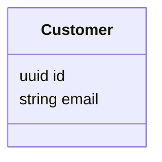

# Quick Start: Setting Up Modular Architecture Docs in GitHub

This guide walks you through creating a real GitHub example repository with the modular, document-driven architecture approach.

---

## Step 1: Create Repository Structure

```bash
mkdir -p my-ecommerce-system
cd my-ecommerce-system
git init

# Create docs folder structure
mkdir -p docs/architecture/domain
mkdir -p docs/architecture/flows
mkdir -p docs/architecture/decisions
mkdir -p docs/user-stories
mkdir -p docs/api

# Create source code folders (optional)
mkdir -p src
mkdir -p tests
```

---

## Step 2: Copy Files from Templates

Copy each template file from `docs-skeleton-templates.md` into your repository:

1. `docs/README.md` — Entry point
2. `docs/requirements.md` — Requirements list
3. `docs/architecture/README.md` — Overview with big picture diagram
4. `docs/architecture/domain/customer.md` — Customer entity
5. `docs/architecture/domain/order.md` — Order entity
6. `docs/architecture/domain/order-item.md` — OrderItem entity (create from template)
7. `docs/architecture/domain/product.md` — Product entity (create from template)
8. `docs/architecture/domain/payment.md` — Payment entity (create from template)
9. `docs/architecture/flows/create-order.md` — Create Order flow
10. `docs/user-stories/README.md` — User stories index (create from template)
11. `docs/user-stories/story-002-place-order.md` — Place Order user story

---

## Step 3: Initialize Git and Commit

```bash
# Create .gitignore
cat > .gitignore << 'EOF'
*.DS_Store
node_modules/
dist/
build/
.env
.idea/
.vscode/
*.log
EOF

# Create main README for the repository
cat > README.md << 'EOF'
# E-Commerce System

A modular, document-driven microservices example for managing e-commerce operations.

## Documentation

All architecture, requirements, and user stories are in the `docs/` folder:

- **[Architecture Overview](docs/architecture/)** — System design and domain model
- **[Requirements](docs/requirements.md)** — Functional and non-functional requirements
- **[User Stories](docs/user-stories/)** — Feature backlog

## Key Features of This Repository

✅ **Diagrams in Code** — All architecture diagrams are Mermaid, versioned with git  
✅ **Modular Docs** — Each concept (entity, flow, story) in its own file  
✅ **Hyperlinked** — Navigate based on what you need, not linear reading order  
✅ **AI-Friendly** — Plain Markdown that AI agents can read and help improve  
✅ **No External Tools** — Everything is plain text, no proprietary formats  
✅ **Scalable** — Add entities and flows without refactoring existing docs  

## How to Use This Repository

1. Start with `docs/README.md` for orientation
2. Explore `docs/architecture/` for the domain model and workflows
3. Check `docs/requirements.md` for what the system must do
4. Browse `docs/user-stories/` for feature definitions
5. Use cross-links to navigate between related concepts

All documentation is navigable—you don't need to read top-to-bottom!

## Making Changes

To update documentation:

1. Edit the relevant `.md` file
2. Update Mermaid diagrams directly in the file
3. Update cross-links if you change file structure
4. Include docs changes in pull requests alongside code changes

Example:

```bash
git checkout -b docs/add-shipping-entity
# Edit docs/architecture/domain/shipping.md
# Update docs/architecture/README.md with new entity
git add docs/
git commit -m "docs: add shipping entity and related flows"
git push origin docs/add-shipping-entity
```

## Repository Structure

```
.
├── README.md                          # This file
├── docs/                              # All documentation
│   ├── README.md                      # Documentation entry point
│   ├── requirements.md                # System requirements
│   ├── architecture/                  # Architecture documentation
│   │   ├── README.md                  # Big picture diagram
│   │   ├── domain/                    # Domain entities
│   │   │   ├── customer.md
│   │   │   ├── order.md
│   │   │   ├── order-item.md
│   │   │   ├── product.md
│   │   │   └── payment.md
│   │   ├── flows/                     # Business process flows
│   │   │   ├── create-order.md
│   │   │   ├── payment-processing.md
│   │   │   └── inventory-management.md
│   │   └── decisions/                 # Architecture Decision Records
│   │       └── adr-0001-uuid-primary-keys.md
│   └── user-stories/                  # Feature definitions
│       ├── README.md                  # Index
│       ├── story-001-customer-registration.md
│       ├── story-002-place-order.md
│       └── story-003-manage-inventory.md
├── src/                               # Source code (placeholder)
├── tests/                             # Tests (placeholder)
└── .gitignore
```

---

## Viewing Diagrams on GitHub

All Mermaid diagrams in `.md` files will render automatically on GitHub:

1. Navigate to any `.md` file containing Mermaid code blocks
2. GitHub renders the diagram in the preview
3. No external tools needed!

Example: Open `docs/architecture/README.md` to see the system architecture diagram.

---

## Tips for Success

### 1. Keep Files Focused
Each file should cover one entity, one flow, or one story. Don't mix concerns.

### 2. Use Relative Links
Link between files using relative paths:

```markdown
[Customer](../domain/customer.md)
[Create Order Flow](../flows/create-order.md)
```

### 3. Include Diagrams Inline
Diagrams should be embedded in the files that explain them:



### 4. Update Docs in PRs
Include documentation updates alongside code changes:

```bash
git add src/Customer.ts docs/architecture/domain/customer.md
git commit -m "feat: add customer email validation\n\nAlso updated customer.md to reflect validation logic"
```

### 5. Cross-Link Generously
Link to related entities, flows, and user stories. This creates the hyperlinked structure.

### 6. Use Consistent Naming
- Entities: `customer.md`, `order.md` (singular, lowercase)
- Flows: `create-order.md`, `payment-processing.md` (verb-noun, hyphenated)
- Stories: `story-001-feature-name.md` (numbered, descriptive)

---

## Example: Adding a New Entity

Say you want to add a `Shipment` entity. Here's the workflow:

### 1. Create the entity file

```bash
touch docs/architecture/domain/shipment.md
```

### 2. Add content (use customer.md as template)

```markdown
# Shipment Entity

...
## Relationships
- Related to [Order](order.md)
```

### 3. Update the big picture

Edit `docs/architecture/README.md`:

```markdown
## Domain Model

The core domain consists of six entities:

- **[Customer](domain/customer.md)**
- **[Order](domain/order.md)**
- **[OrderItem](domain/order-item.md)**
- **[Product](domain/product.md)**
- **[Payment](domain/payment.md)**
- **[Shipment](domain/shipment.md)** ← NEW
```

### 4. Update related flows and stories

Edit any flow files or user stories that reference shipping.

### 5. Commit

```bash
git add docs/
git commit -m "docs: add Shipment entity\n\nNew entity tracks order shipments and delivery"
```

---

## Exporting to Confluence or Draw.io (Optional)

Since all diagrams are Mermaid:

1. **Export to PNG/SVG:**
   - Visit https://mermaid.live
   - Paste Mermaid code from your `.md` file
   - Export as PNG or SVG
   - Download and use in presentations or Confluence

2. **Import into Draw.io:**
   - Open https://app.diagrams.net
   - File → Import from → URL or paste diagram code
   - Edit and export as needed

3. **Confluence Integration:**
   - Use Mermaid Markdown plugin for Confluence
   - Or export diagrams to PNG and embed as images
   - Keep source truth in GitHub, export as needed

---

## Syncing with Your Code

The key benefit: **Update docs at the same time as code**

```bash
# Developer working on new feature
git checkout -b feature/customer-tiers
# Edit src/Customer.ts
# Edit docs/architecture/domain/customer.md (add fields/methods)
# Edit docs/architecture/flows/create-order.md (if flow changes)
git add src/ docs/
git commit -m "feat: add customer tier system\n\nAlso updated architecture docs to reflect new tier logic"
git push origin feature/customer-tiers
```

PR reviewers see both code AND documentation changes together. Diagrams never get out of sync!

---

## Questions?

- **"Can I use this as a real project?"** Yes! This is a complete working example.
- **"Can I extend the diagrams?"** Absolutely! Mermaid supports class, ER, sequence, state, and more.
- **"How do I handle large systems?"** Add more files in `docs/architecture/domain/` and `docs/architecture/flows/`. The modular structure scales.
- **"What about deployment, infrastructure, etc.?"** Add a `docs/infrastructure/` folder with similar structure if needed.

---

## Next Steps

1. Clone or fork this repository
2. Customize entity names and relationships for your domain
3. Add more flows and user stories
4. Create pull requests with documentation-first changes
5. Use AI agents to help improve and maintain documentation
6. Watch your architecture stay in sync with your code!

Happy documenting! 🚀

