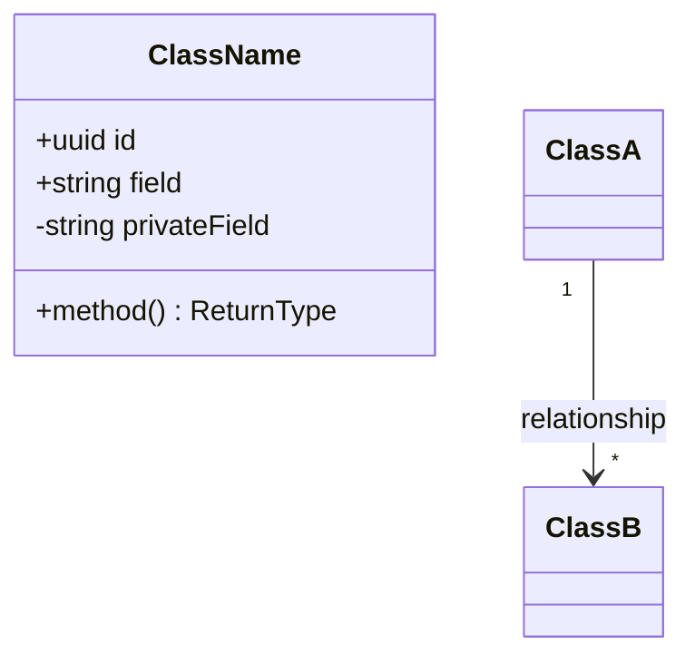
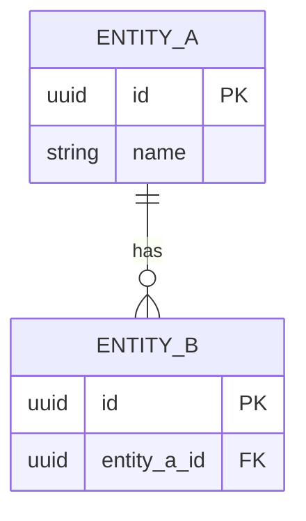
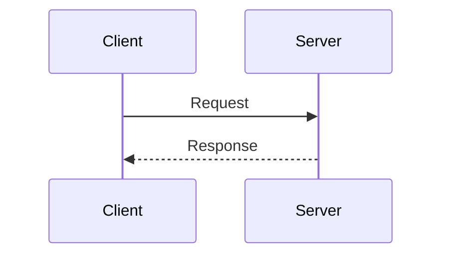
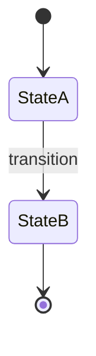
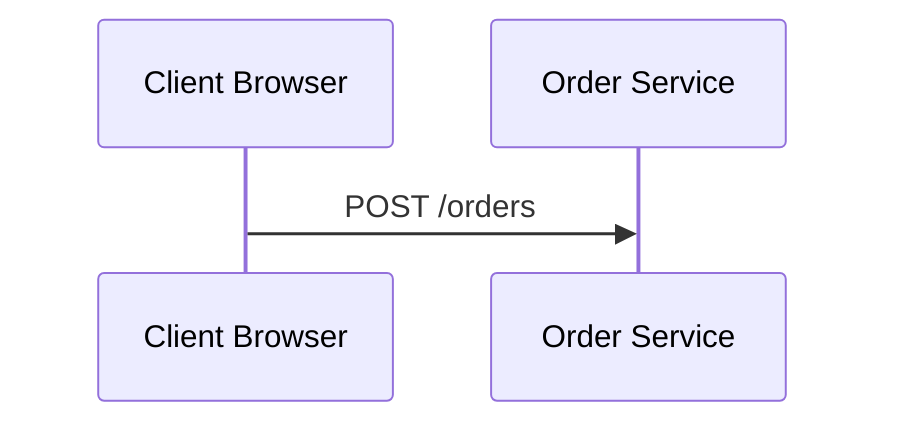

# Contributing to Architecture Diagrams in Code

Thank you for your interest in contributing! This document explains how to work with documentation in this repository.

## Philosophy

This repository demonstrates **Architecture as Code** — keeping all diagrams and documentation in the repository alongside source code, versioned with Git.

### Key Principles

1. **Diagrams are code artifacts** — They live in Markdown as Mermaid
2. **Modular documentation** — One file per concept
3. **Hyperlinked navigation** — Cross-reference related concepts
4. **DRY principle** — Define once, reference via links
5. **Version controlled** — Update docs with code in same commit

---

## Getting Started

### Prerequisites

- Git
- Text editor with Markdown support (VS Code, IntelliJ, etc.)
- Optional: Mermaid Live Editor (https://mermaid.live) for diagram preview

### Fork and Clone

```bash
git clone https://github.com/YOUR_USERNAME/architecture-diagrams-in-code.git
cd architecture-diagrams-in-code
```

---

## Making Changes

### Workflow

1. **Create a branch** for your changes
2. **Edit Markdown files** with embedded Mermaid diagrams
3. **Update cross-links** if you add/remove files
4. **Commit with clear messages**
5. **Push and create pull request**

### Example: Adding a New Entity

Let's add a `Shipment` entity:

```bash
# 1. Create branch
git checkout -b docs/add-shipment-entity

# 2. Create entity file
touch docs/architecture/domain/shipment.md

# 3. Edit the file (see template below)

# 4. Update the architecture overview
# Edit docs/architecture/README.md to add Shipment

# 5. Update related flows if needed
# Edit docs/architecture/flows/create-order.md if shipment is involved

# 6. Commit
git add docs/
git commit -m "docs: add Shipment entity

- Add shipment.md with class and ER diagrams
- Update architecture overview to reference shipment
- Link from create-order flow"

# 7. Push
git push origin docs/add-shipment-entity

# 8. Create pull request on GitHub
```

---

## File Structure

### Domain Entity Template

```markdown
# [Entity Name] Entity

Brief description.

## Business Logic

What this entity represents and its purpose.

## Class Diagram

\`\`\`mermaid
classDiagram
    class EntityName {
        +uuid id
        +string field
        +method() returnType
    }
\`\`\`

## Database Schema

\`\`\`mermaid
erDiagram
    ENTITY_NAME {
        uuid id PK
        string field
    }
\`\`\`

## Fields

| Field | Type | Constraints | Description |
|-------|------|-------------|-------------|
| `id` | uuid | PK | Description |

## Relationships

- Relationship description with [link to other entity](other-entity.md)

## Methods

### `methodName(): ReturnType`
Description

## Related Flows

- [Flow Name](../flows/flow-name.md)

## Related Requirements

- **FR-XXX:** Description ([Requirements](../../requirements.md))
```

### Workflow Template

```markdown
# [Flow Name] Flow

Description of the workflow.

## Overview

High-level summary.

## Sequence Diagram

\`\`\`mermaid
sequenceDiagram
    participant A
    participant B
    
    A ->> B: Message
    B -->> A: Response
\`\`\`

## Step-by-Step Description

1. Step one
2. Step two

## Error Handling

How errors are handled.

## Related Entities

- [Entity](../domain/entity.md)

## Related Requirements

- **FR-XXX:** Description
```

---

## Mermaid Diagram Guidelines

### Class Diagrams



### Entity-Relationship Diagrams



### Sequence Diagrams



### State Diagrams



---

## Cross-Linking

Use relative paths to link between files:

```markdown
# From docs/architecture/domain/order.md

See the [Customer](customer.md) entity.
Related flow: [Create Order](../flows/create-order.md).
User story: [Place Order](../../user-stories/story-002-place-order.md).
```

### Link Validation

Before submitting PR, verify all links work:

```bash
# On GitHub, preview the file to ensure links resolve
# Or use a Markdown link checker tool
```

---

## Commit Message Guidelines

Follow conventional commits:

```
docs: add Payment entity with Stripe integration

feat: implement order cancellation
docs: update order flow with cancellation steps

fix: correct customer ER diagram FK reference
```

### Scope Prefixes

- `docs:` — Documentation changes
- `feat:` — New features (with docs)
- `fix:` — Bug fixes (with docs if needed)
- `refactor:` — Code refactoring (update docs if architecture changes)

---

## Pull Request Process

1. **Create PR** with clear title and description
2. **Reference related issues** if applicable
3. **Request review** from maintainers
4. **Address feedback** and update as needed
5. **Squash commits** if requested
6. **Merge** once approved

### PR Description Template

```markdown
## Summary
Brief description of changes.

## Changes
- Added Shipment entity
- Updated architecture overview
- Linked from create-order flow

## Screenshots (if UI changes)
N/A (documentation only)

## Checklist
- [x] All Mermaid diagrams render correctly
- [x] Cross-links are valid
- [x] Related files updated
- [x] Commit messages follow guidelines
```

---

## Best Practices

### 1. Keep Files Focused
Each file should cover one entity, flow, or story. Don't mix concerns.

### 2. Use Clear Diagram Labels


### 3. Explain Diagrams
Don't just show diagrams—add context:

```markdown
## Sequence Diagram

The following diagram shows how orders are processed:

\`\`\`mermaid
...
\`\`\`

### Key Points
- Payment processed before inventory reduction
- Transaction ensures atomicity
```

### 4. Update Cross-References
When adding/removing files, update all references.

### 5. Test Mermaid Syntax
Use https://mermaid.live to validate syntax before committing.

---

## Questions?

- **General questions:** Open a GitHub Discussion
- **Bug reports:** Create an issue
- **Feature requests:** Create an issue with "enhancement" label

---

## Code of Conduct

Be respectful, constructive, and collaborative. This is an educational repository—help others learn!

---

**Thank you for contributing to better architecture documentation!** 🚀

