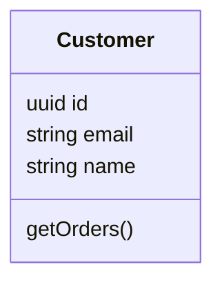
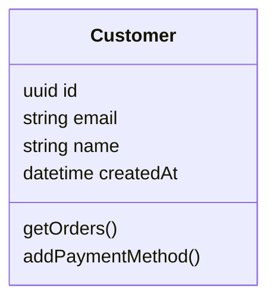
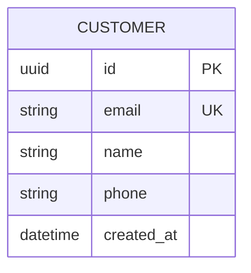
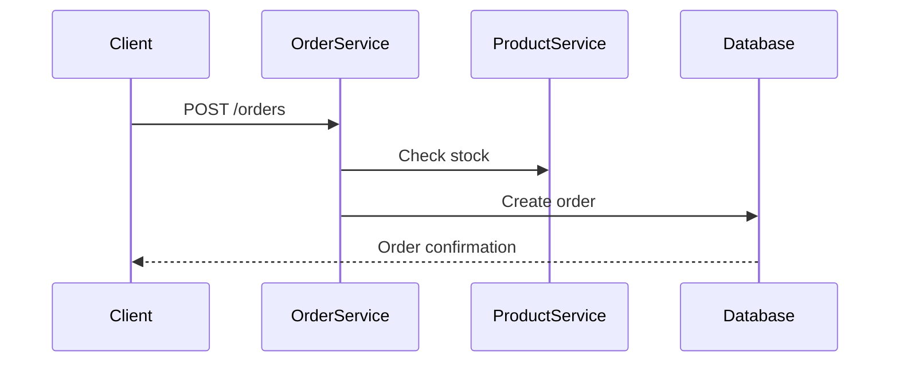

# Architecture Diagrams in Code

A complete example demonstrating how to keep architecture diagrams **in your repository** using Markdown + Mermaid, instead of expensive external tools.

## 🎯 The Problem This Solves

Traditional architecture documentation suffers from:

- **Sync Issues** — Diagrams in Confluence, draw.io, or Visio get out of sync with code
- **No Version Control** — Can't diff or review architecture changes alongside code
- **Tool Lock-in** — Proprietary formats that AI agents can't read or help improve
- **Maintenance Burden** — Updating diagrams across multiple tools is slow and error-prone

## ✨ The Solution

Keep all architecture diagrams **as plain text Mermaid** in Markdown files, versioned with your code:

✅ **Single Source of Truth** — Diagrams live in the repository with code  
✅ **Git-Native** — Version controlled, diffable, reviewable in pull requests  
✅ **AI-Friendly** — Plain text that AI agents can read, understand, and help improve  
✅ **Tool-Agnostic** — No expensive licenses, works in any IDE or text editor  
✅ **Export Anywhere** — Convert to PNG, SVG, Confluence, or draw.io when needed  
✅ **Modular** — Each concept (entity, flow, story) in its own file for easy navigation

## 📚 Documentation Structure

All architecture, requirements, and user stories are in the `docs/` folder:

- **[Documentation Hub](docs/README.md)** — Start here for navigation
- **[Architecture Overview](docs/architecture/README.md)** — System design and domain model
- **[Requirements](docs/requirements.md)** — Functional and non-functional requirements
- **[User Stories](docs/user-stories/README.md)** — Feature backlog and acceptance criteria

### Quick Links

- **Domain Model:**
  - [Customer](docs/architecture/domain/customer.md)
  - [Order](docs/architecture/domain/order.md)
  - [OrderItem](docs/architecture/domain/order-item.md)
  - [Product](docs/architecture/domain/product.md)
  - [Payment](docs/architecture/domain/payment.md)

- **Business Flows:**
  - [Create Order Flow](docs/architecture/flows/create-order.md)
  - [Payment Processing Flow](docs/architecture/flows/payment-processing.md)
  - [Inventory Management Flow](docs/architecture/flows/inventory-management.md)

## 🚀 How This Repository Works

### 1. Modular Documentation

Each concept lives in its own file:

```
docs/architecture/domain/customer.md  ← Customer entity with diagrams
docs/architecture/domain/order.md     ← Order entity with diagrams
docs/architecture/flows/create-order.md ← Order creation sequence diagram
```

### 2. Mermaid Diagrams Embedded

Every entity and flow includes inline Mermaid diagrams:



### 3. Hyperlinked Navigation

Documents cross-link to related concepts:

```markdown
See the [Customer](domain/customer.md) entity for more details.
This flows through the [Create Order Flow](flows/create-order.md).
```

### 4. Version Controlled with Code

Update diagrams in the same pull request as code changes:

```bash
git checkout -b feature/customer-tiers
# Edit src/Customer.ts
# Edit docs/architecture/domain/customer.md
git commit -m "feat: add customer tier system"
```

## 💡 Key Benefits

### For Developers
- See architecture diagrams **in your IDE** alongside code
- Review diagram changes **in pull requests**
- No context switching to external tools

### For Architects
- Keep diagrams **in sync with implementation**
- Modular structure scales to large systems
- Export to any format when needed (PNG, Confluence, etc.)

### For AI Collaboration
- AI agents can **read and understand** plain text diagrams
- Get help **refactoring both code and diagrams** together
- No proprietary formats blocking AI assistance

### For Teams
- **Single source of truth** in the repository
- Diagrams are **reviewed alongside code**
- No expensive tool licenses required

## 📖 Example: Customer Entity

From [docs/architecture/domain/customer.md](docs/architecture/domain/customer.md):

**Class Diagram:**



**Database Schema:**



Each entity file includes:
- Business logic explanation
- Class diagram showing methods and fields
- Database schema (ER diagram)
- Relationships to other entities (with links)
- Related workflows and user stories

## 🔄 Example: Create Order Flow

From [docs/architecture/flows/create-order.md](docs/architecture/flows/create-order.md):

Sequence diagrams show how requests flow through the system:



*(Simplified for README — see the actual file for complete flow)*

## 🛠️ Using This Repository

### For Learning

1. Start with [docs/README.md](docs/README.md) for orientation
2. Explore [docs/architecture/](docs/architecture/) for domain model and workflows
3. See how entities cross-link to flows and user stories
4. Notice how diagrams are embedded directly in explanations

### For Your Own Project

1. **Fork or clone** this repository
2. **Customize** entity names and relationships for your domain
3. **Add** new entities in `docs/architecture/domain/`
4. **Add** new flows in `docs/architecture/flows/`
5. **Update** cross-links as you restructure
6. **Commit** docs alongside code changes

### For Exporting

All diagrams can be exported:

- **To PNG/SVG:** Use https://mermaid.live or CLI tools
- **To Confluence:** Use Mermaid plugin or export as images
- **To draw.io:** Import Mermaid via app.diagrams.net

The repository is the **source of truth**; exports are derivatives.

## 🎓 What You'll Learn

After exploring this repository, you'll understand:

- ✅ How to organize architecture documentation modularly
- ✅ How to embed Mermaid diagrams in Markdown
- ✅ How to use hyperlinks for navigation (not linear reading)
- ✅ How to version diagrams with Git
- ✅ How to review diagrams in pull requests
- ✅ How to keep documentation in sync with code
- ✅ How AI agents can help maintain documentation

## 📝 Making Changes

To update documentation:

1. Edit the relevant `.md` file in `docs/`
2. Update Mermaid diagrams directly in the file
3. Update cross-links if you change file structure
4. Include docs changes in pull requests alongside code

Example workflow:

```bash
git checkout -b docs/add-shipping-entity
# Create docs/architecture/domain/shipping.md
# Update docs/architecture/README.md to reference it
git add docs/
git commit -m "docs: add shipping entity"
git push origin docs/add-shipping-entity
```

## 🌟 Philosophy

This repository demonstrates:

- **Architecture as Code** — Diagrams are code artifacts, not external documents
- **Monorepo Best Practices** — Single source of truth for code + docs
- **DRY Principle** — Define each concept once, reference via links
- **Progressive Disclosure** — Navigate to what you need, not forced linear reading
- **AI Collaboration** — Plain text enables AI agents to help maintain docs

## 📚 Related Resources

- **Mermaid Documentation:** https://mermaid.js.org/
- **Mermaid Live Editor:** https://mermaid.live
- **C4 Model (advanced):** https://c4model.com/
- **Architecture Decision Records (ADRs):** https://adr.github.io/

## 🤝 Contributing

This is an educational example repository. Feel free to:

- Fork and adapt for your own projects
- Submit issues for clarifications or improvements
- Share how you've adapted this approach in your organization

## 📄 License

MIT License — Free to use and adapt for any purpose.

---

**Ready to get started?** Begin with [docs/README.md](docs/README.md) and explore the architecture! 🚀
