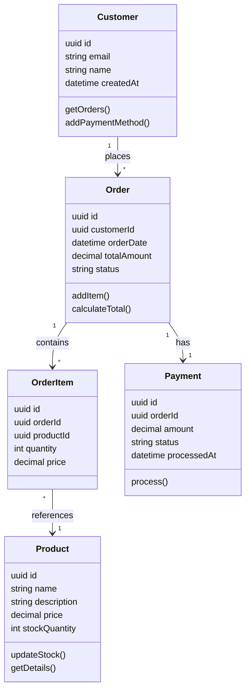
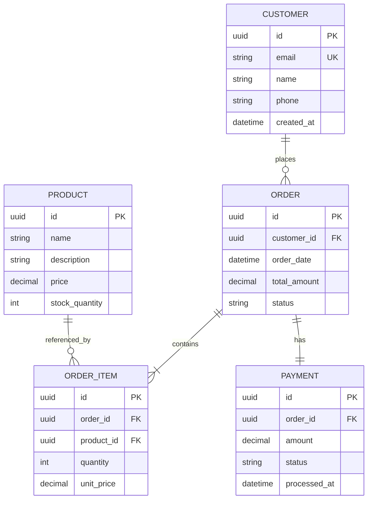
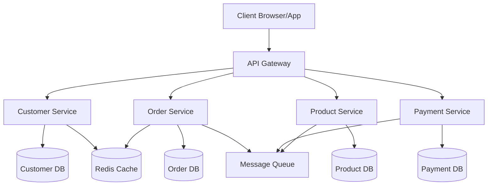

# System Architecture

## Overview

This system is an e-commerce platform built with microservices architecture. The design follows domain-driven principles with event-driven communication between services.

## System Architecture Diagram

## Domain Model

The core domain consists of five entities:

- **[Customer](domain/customer.md)** — Users who place orders
- **[Order](domain/order.md)** — Purchase requests with multiple items
- **[OrderItem](domain/order-item.md)** — Individual items in an order
- **[Product](domain/product.md)** — Items available for sale
- **[Payment](domain/payment.md)** — Payment information for orders

## Database Schema Overview

## Workflows

Key business processes:

- **[Create Order Flow](flows/create-order.md)** — How customers place orders
- **[Payment Processing Flow](flows/payment-processing.md)** — How payments are processed
- **[Inventory Management Flow](flows/inventory-management.md)** — How stock is tracked and updated

## Architecture Decisions

Important design decisions are recorded in [Architecture Decision Records](decisions/):

- [ADR-0001: Use UUIDs for Primary Keys](decisions/adr-0001-uuid-primary-keys.md)

## Design Principles

### Microservices Boundaries
- **Customer Service** — Manages customer accounts and profiles
- **Order Service** — Handles order creation and tracking
- **Product Service** — Manages product catalog and inventory
- **Payment Service** — Processes payments and handles transactions

### Communication Patterns
- **Synchronous:** REST APIs for request-response operations
- **Asynchronous:** Event bus for cross-service notifications
- **Database:** Each service owns its data (no shared databases)

### Data Consistency
- **Transactions:** ACID guarantees within service boundaries
- **Eventual Consistency:** Between services via events
- **Idempotency:** All operations designed to be safely retried

## Technology Stack

- **Language:** TypeScript/Node.js (or Java/Kotlin)
- **Database:** PostgreSQL with read replicas
- **Cache:** Redis for session and frequently accessed data
- **Message Queue:** RabbitMQ or Kafka for event streaming
- **API Gateway:** Kong or similar for routing and auth
- **Container Orchestration:** Kubernetes

## Quality Attributes

See [Requirements](../requirements.md) for detailed performance, reliability, security, and scalability requirements.

### Key Metrics
- **Availability:** 99.9% uptime (8.76 hours downtime/year)
- **Response Time:** p99 < 2 seconds for order creation
- **Throughput:** 1,000 concurrent users
- **Scalability:** Horizontal scaling for all services

## Deployment Architecture

## Related Documentation

- **[Domain Entities](domain/)** — Detailed entity specifications
- **[Workflows](flows/)** — Sequence diagrams and process flows
- **[Requirements](../requirements.md)** — System requirements
- **[User Stories](../user-stories/)** — Feature definitions

---

**Next Steps:**
- Explore individual [domain entities](domain/) for detailed specifications
- Review [workflows](flows/) to understand request processing
- Check [architecture decisions](decisions/) for rationale behind key choices

