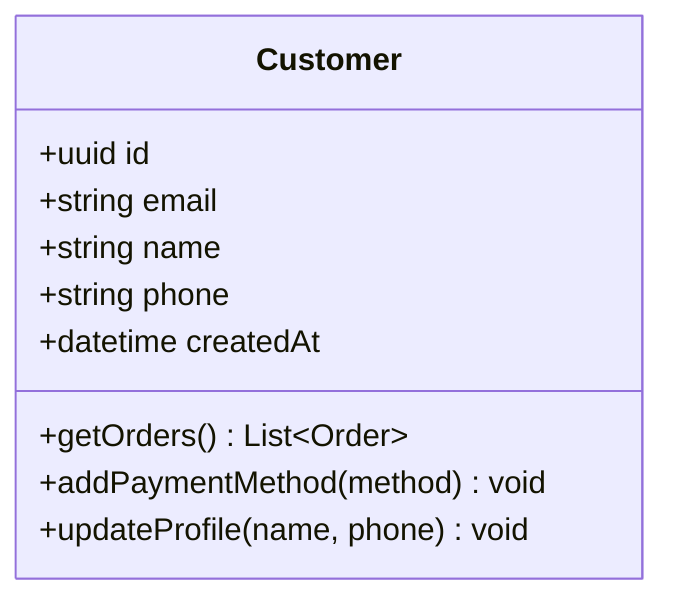
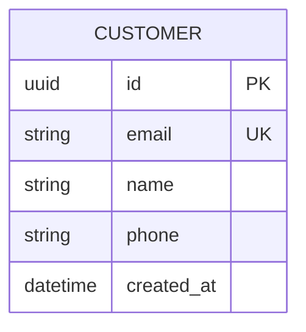
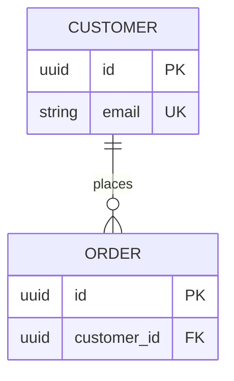

# Customer Entity

The Customer entity represents a user who can place orders in the system.

## Business Logic

A customer:
- Has a unique identity (UUID)
- Can place multiple orders
- Can manage multiple payment methods
- Has contact information (email, name, phone)
- Tracks creation timestamp for auditing

## Class Diagram



## Database Schema



## Fields

| Field | Type | Constraints | Description |
|-------|------|-------------|-------------|
| `id` | uuid | PK | Unique customer identifier |
| `email` | string | UNIQUE, NOT NULL | Customer email address |
| `name` | string | NOT NULL | Customer full name |
| `phone` | string | NULLABLE | Customer phone number |
| `created_at` | datetime | NOT NULL | Account creation timestamp |

## Relationships

- **Places [Orders](order.md)** (1 customer : many orders)
- **Has [Payments](payment.md)** (indirectly through orders)



## Business Rules

### Email Uniqueness
- Email must be unique across all customers
- Email validation must follow RFC 5322 standard
- Email changes require verification

### Account Creation
- Password must be hashed with bcrypt (cost factor ≥ 12)
- Email verification required before first order
- Default status is "pending_verification"

### Data Retention
- Customer data retained for 7 years after last order (compliance)
- Anonymization supported for GDPR "right to be forgotten"

## Methods

### `getOrders(): List<Order>`
Retrieves all orders for this customer, sorted by order date descending.

**Example:**
```typescript
const customer = await Customer.findById(customerId);
const orders = await customer.getOrders();
```

### `addPaymentMethod(method: PaymentMethod): void`
Registers a new payment method for the customer.

**Validation:**
- Payment method must pass Stripe validation
- Customer can have maximum 5 active payment methods

### `updateProfile(name: string, phone: string): void`
Updates customer profile information.

**Validation:**
- Name must be 2-100 characters
- Phone must match E.164 format if provided

## API Endpoints

- `GET /customers/{id}` — Retrieve customer details
- `PUT /customers/{id}` — Update customer profile
- `GET /customers/{id}/orders` — List customer orders
- `POST /customers/{id}/payment-methods` — Add payment method

## Related Flows

- [Create Order Flow](../flows/create-order.md) — Uses Customer entity to validate orders
- [Payment Processing Flow](../flows/payment-processing.md) — References customer payment methods

## Related Requirements

- **FR-001:** User registration ([Requirements](../../requirements.md))
- **FR-002:** Profile updates ([Requirements](../../requirements.md))
- **NFR-010:** Password security ([Requirements](../../requirements.md))

## Related User Stories

- [Customer Registration](../../user-stories/story-001-customer-registration.md)
- [Place Order](../../user-stories/story-002-place-order.md)

---

**Related Entities:**
- [Order](order.md) — Orders placed by this customer
- [Payment](payment.md) — Payments made by this customer
