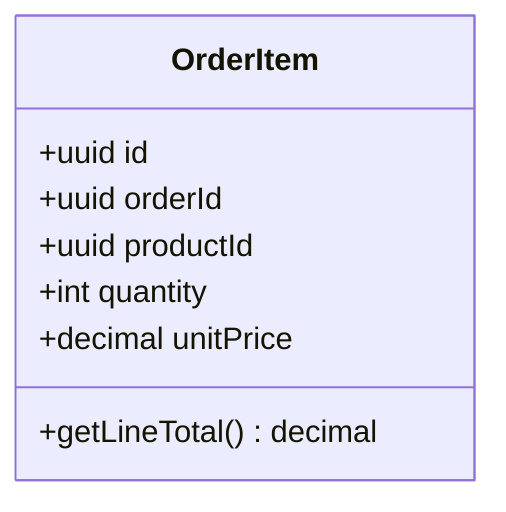
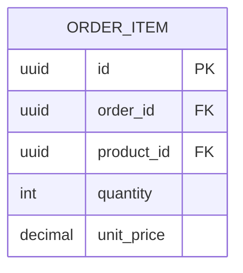
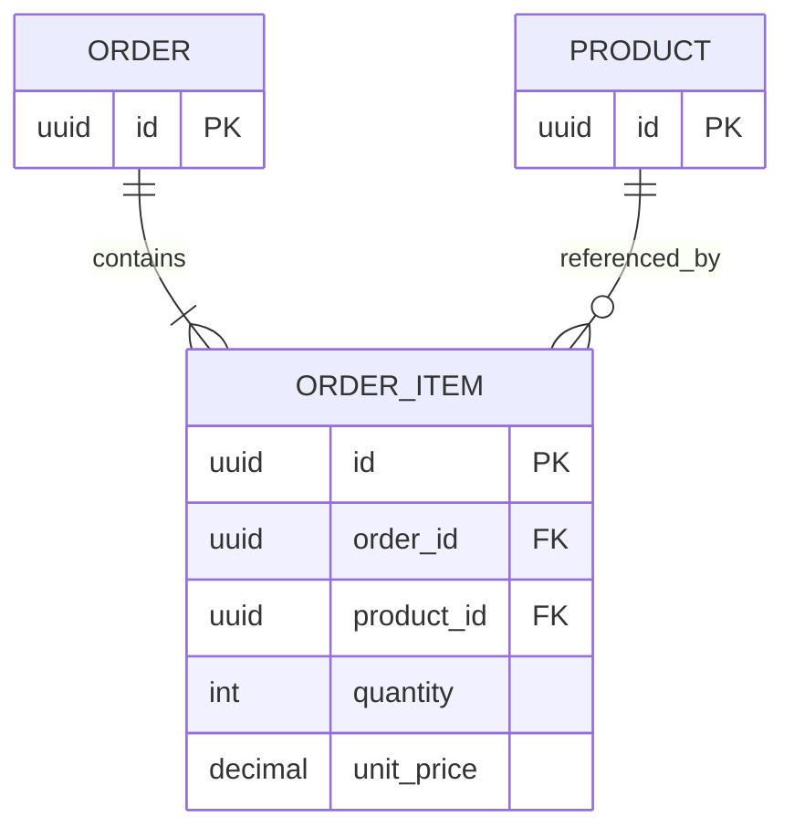

# OrderItem Entity

The OrderItem entity represents an individual product within an order.

## Business Logic

An order item:
- Belongs to a single order
- References a specific product
- Has a quantity (how many units)
- Captures the unit price at time of order (price may change later)
- Contributes to the order's total amount

## Class Diagram



## Database Schema



## Fields

| Field | Type | Constraints | Description |
|-------|------|-------------|-------------|
| `id` | uuid | PK | Unique order item identifier |
| `order_id` | uuid | FK, NOT NULL | Reference to Order |
| `product_id` | uuid | FK, NOT NULL | Reference to Product |
| `quantity` | int | NOT NULL, > 0 | Number of units ordered |
| `unit_price` | decimal(10,2) | NOT NULL | Price per unit at order time |

## Relationships

- **Belongs to [Order](order.md)** (many items : 1 order)
- **References [Product](product.md)** (many items : 1 product)



## Business Rules

### Price Capture
- Unit price is captured at order creation time
- Price is immutable after order is placed
- If product price changes later, order item retains original price

**Rationale:** Historical pricing for accounting and customer trust.

### Quantity Validation
- Quantity must be ≥ 1
- Quantity must not exceed available stock at order time
- Maximum quantity per item: 999 units

### Product Reference
- Product must exist at order creation time
- If product is later deleted, order item retains product_id for historical records
- Product name/description should be denormalized for display (not shown in simplified schema)

## Methods

### `getLineTotal(): decimal`
Calculates the total price for this line item.

**Formula:**
```
lineTotal = quantity × unitPrice
```

**Example:**
```typescript
const orderItem = await OrderItem.findById(itemId);
const total = orderItem.getLineTotal(); // e.g., 3 × $49.99 = $149.97
```

## Example Data

| id | order_id | product_id | quantity | unit_price | line_total |
|----|----------|------------|----------|------------|------------|
| uuid-1 | order-123 | prod-abc | 2 | 29.99 | 59.98 |
| uuid-2 | order-123 | prod-def | 1 | 149.99 | 149.99 |
| uuid-3 | order-456 | prod-abc | 5 | 29.99 | 149.95 |

## API Endpoints

- `GET /orders/{orderId}/items` — List items in an order
- `POST /orders/{orderId}/items` — Add item to order (before confirmation)
- `PATCH /orders/{orderId}/items/{id}` — Update quantity (before confirmation)
- `DELETE /orders/{orderId}/items/{id}` — Remove item (before confirmation)

## Related Flows

- [Create Order Flow](../flows/create-order.md) — Order items created during order placement
- [Inventory Management Flow](../flows/inventory-management.md) — Stock reduced by item quantities

## Related Requirements

- **FR-004:** Multiple items per order ([Requirements](../../requirements.md))
- **FR-012:** Atomic inventory updates ([Requirements](../../requirements.md))

## Related User Stories

- [Place Order](../../user-stories/story-002-place-order.md)

## Implementation Notes

### Denormalization for Performance

In production systems, consider denormalizing product name and description:

```sql
CREATE TABLE order_item (
    id UUID PRIMARY KEY,
    order_id UUID NOT NULL REFERENCES orders(id),
    product_id UUID NOT NULL REFERENCES products(id),
    quantity INT NOT NULL CHECK (quantity > 0),
    unit_price DECIMAL(10,2) NOT NULL,
    product_name VARCHAR(255) NOT NULL,  -- denormalized
    product_description TEXT              -- denormalized
);
```

**Benefits:**
- Display order history even if product is deleted
- Avoid joins when fetching order details
- Preserve historical product information

**Trade-off:**
- Slight data duplication
- Increased storage (acceptable for order history)

---

**Related Entities:**
- [Order](order.md) — Parent order containing this item
- [Product](product.md) — Product being ordered
- [Payment](payment.md) — Payment covers all items in order
