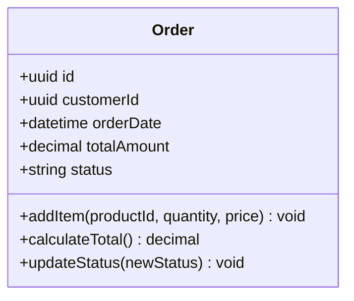
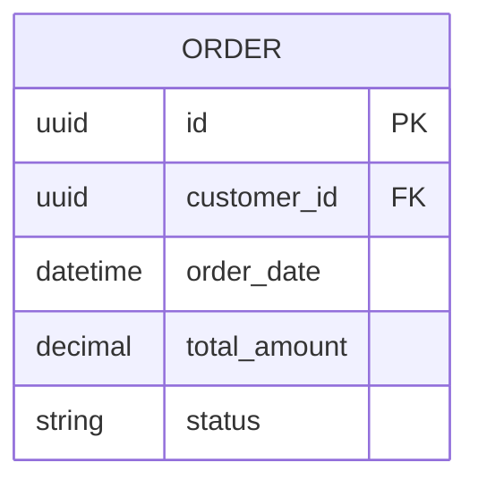
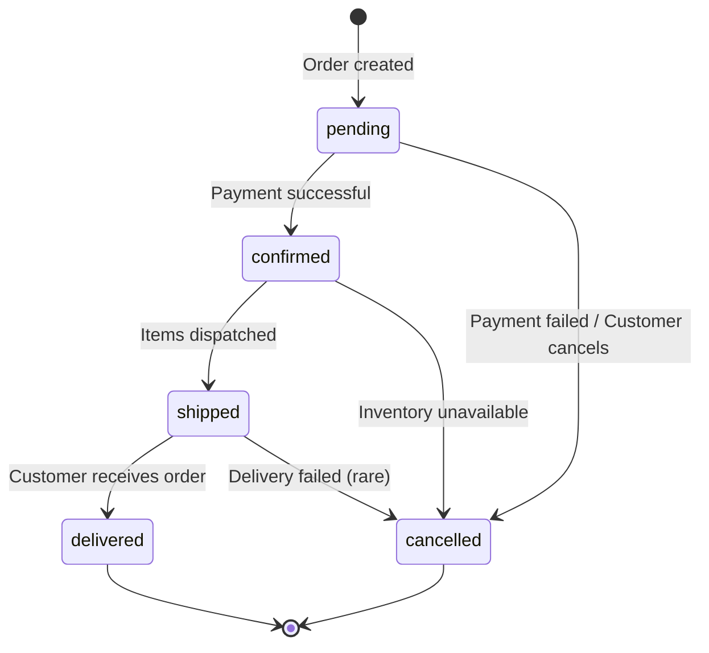
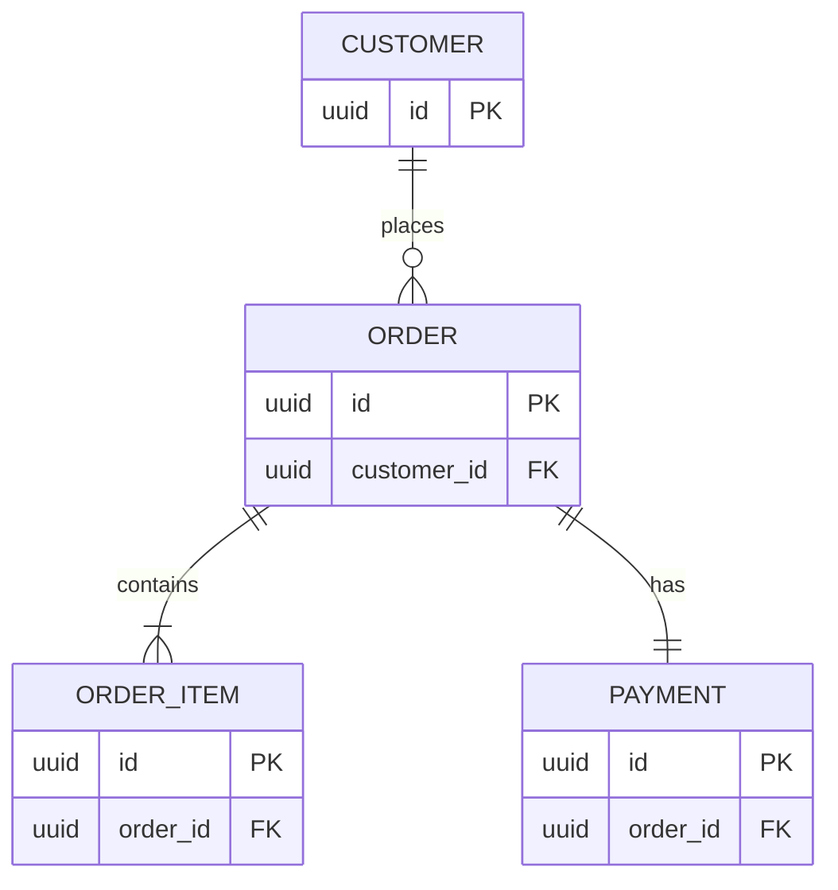

# Order Entity

The Order entity represents a customer's purchase request.

## Business Logic

An order:
- Belongs to a single customer
- Contains one or more order items
- Has a total amount calculated from items
- Tracks order status (pending, confirmed, shipped, delivered)
- Is associated with a single payment
- Is created with a timestamp

## Class Diagram



## Database Schema



## Fields

| Field | Type | Constraints | Description |
|-------|------|-------------|-------------|
| `id` | uuid | PK | Unique order identifier |
| `customer_id` | uuid | FK, NOT NULL | Reference to Customer |
| `order_date` | datetime | NOT NULL | When order was placed |
| `total_amount` | decimal(10,2) | NOT NULL | Sum of all items |
| `status` | string | NOT NULL | Current order status |

## Status Values

| Status | Description |
|--------|-------------|
| `pending` | Order placed, awaiting payment |
| `confirmed` | Payment successful, preparing shipment |
| `shipped` | Order sent to customer |
| `delivered` | Order received by customer |
| `cancelled` | Order cancelled by customer or system |

## Status Transitions



## Relationships

- **Belongs to [Customer](customer.md)** (many orders : 1 customer)
- **Contains [OrderItems](order-item.md)** (1 order : many items)
- **Has [Payment](payment.md)** (1 order : 1 payment)



## Business Rules

### Order Creation
- Order must have at least 1 item
- All items must be in stock at creation time
- Total amount must match sum of (item quantity × unit price)

### Payment Requirement
- Order cannot transition to "confirmed" without successful payment
- Payment must be processed within 15 minutes of order creation
- After 15 minutes, pending orders are automatically cancelled

### Cancellation
- Customers can cancel orders in "pending" or "confirmed" status
- Orders in "shipped" or "delivered" cannot be cancelled (use returns instead)
- Cancelled orders trigger inventory restoration

## Methods

### `addItem(productId: uuid, quantity: int, price: decimal): void`
Adds an item to the order.

**Validation:**
- Product must exist and have sufficient stock
- Quantity must be > 0
- Price must match current product price

**Example:**
```typescript
const order = new Order(customerId);
await order.addItem(productId, 2, 49.99);
```

### `calculateTotal(): decimal`
Recalculates the total amount from all order items.

**Formula:**
```
total = Σ(item.quantity × item.unitPrice)
```

### `updateStatus(newStatus: string): void`
Updates the order status.

**Validation:**
- Must follow valid status transitions (see state diagram)
- Status change triggers notifications and events

## API Endpoints

- `POST /orders` — Create new order
- `GET /orders/{id}` — Retrieve order details
- `PATCH /orders/{id}/status` — Update order status
- `DELETE /orders/{id}` — Cancel order (if allowed)

## Related Flows

- [Create Order Flow](../flows/create-order.md) — Complete order creation process
- [Payment Processing Flow](../flows/payment-processing.md) — Payment and confirmation
- [Inventory Management Flow](../flows/inventory-management.md) — Stock updates

## Related Requirements

- **FR-004:** Place orders ([Requirements](../../requirements.md))
- **FR-005:** View order history ([Requirements](../../requirements.md))
- **NFR-001:** Order creation performance ([Requirements](../../requirements.md))

## Related User Stories

- [Place Order](../../user-stories/story-002-place-order.md)
- [Track Order Status](../../user-stories/story-003-track-order.md)

---

**Related Entities:**
- [Customer](customer.md) — Who placed this order
- [OrderItem](order-item.md) — Items in this order
- [Payment](payment.md) — Payment for this order
- [Product](product.md) — Products ordered

