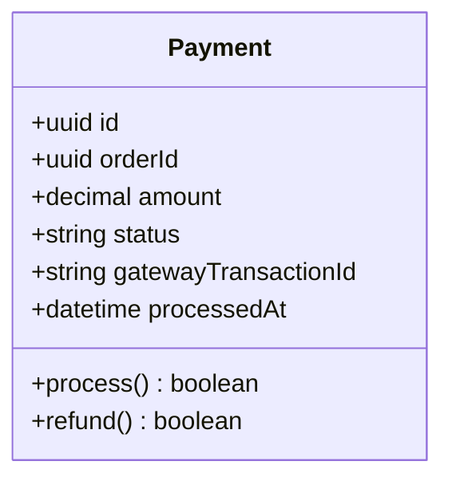
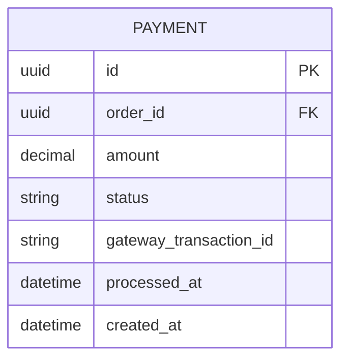
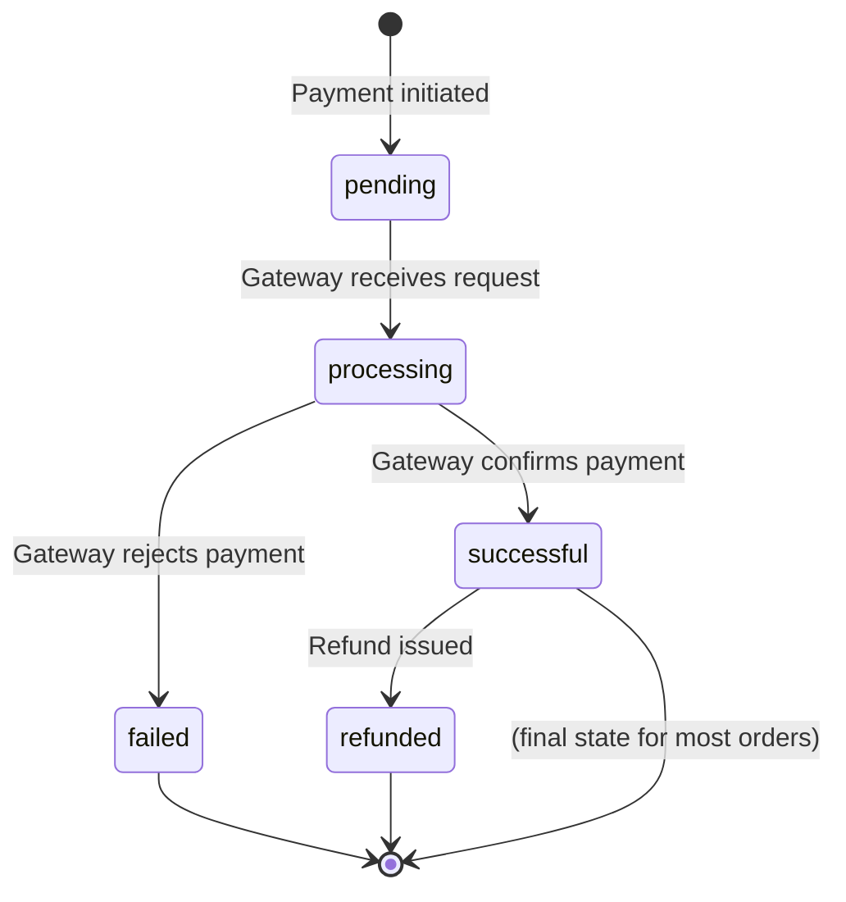
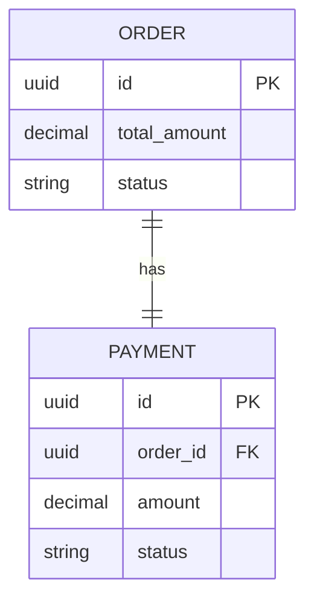
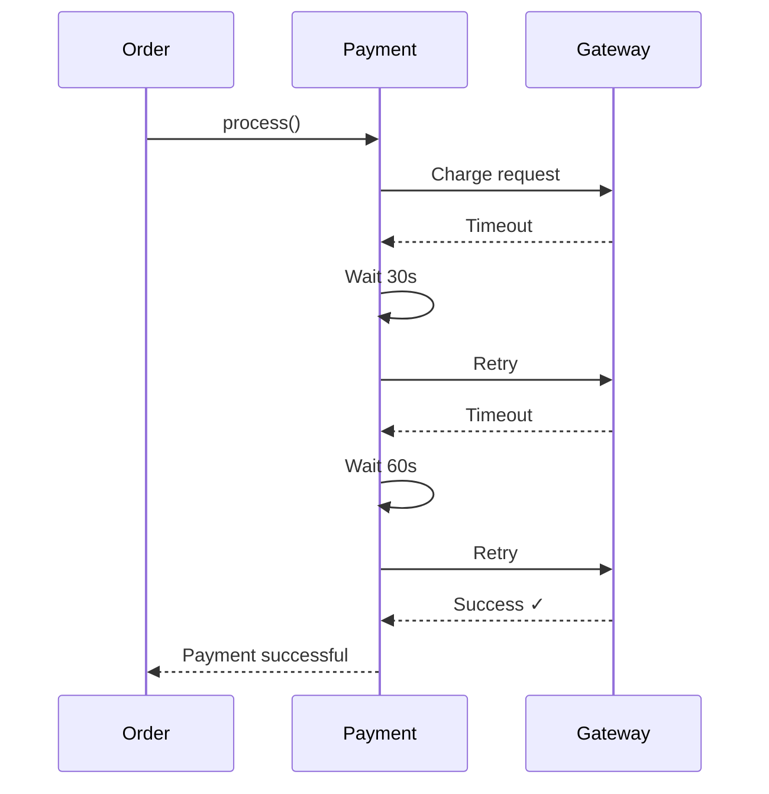

# Payment Entity

The Payment entity represents a payment transaction for an order.

## Business Logic

A payment:
- Belongs to a single order (1:1 relationship)
- Has an amount that matches the order total
- Tracks payment status (pending, successful, failed)
- Records when payment was processed
- Integrates with external payment gateway (e.g., Stripe)

## Class Diagram



## Database Schema



## Fields

| Field | Type | Constraints | Description |
|-------|------|-------------|-------------|
| `id` | uuid | PK | Unique payment identifier |
| `order_id` | uuid | FK, UNIQUE, NOT NULL | Reference to Order |
| `amount` | decimal(10,2) | NOT NULL, > 0 | Payment amount |
| `status` | string | NOT NULL | Payment status |
| `gateway_transaction_id` | string | NULLABLE | External gateway transaction ID |
| `processed_at` | datetime | NULLABLE | When payment completed |
| `created_at` | datetime | NOT NULL | When payment record was created |

## Status Values

| Status | Description |
|--------|-------------|
| `pending` | Payment initiated, awaiting gateway response |
| `processing` | Payment being processed by gateway |
| `successful` | Payment completed successfully |
| `failed` | Payment failed (insufficient funds, invalid card, etc.) |
| `refunded` | Payment was refunded to customer |

## Status Transitions



## Relationships

- **Belongs to [Order](order.md)** (1 payment : 1 order)



## Business Rules

### Amount Validation
- Payment amount must exactly match order total_amount
- Amount is validated before processing
- Mismatch triggers payment failure

### One Payment Per Order
- Each order has exactly one payment
- Failed payments create new payment records (don't update existing)
- Retry logic creates new payment attempts

### Payment Gateway Integration
- Payment must be idempotent (safe to retry)
- Gateway transaction ID stored for reconciliation
- Failed payments trigger order cancellation after 3 attempts

### Refund Policy
- Refunds only allowed for "successful" payments
- Refund amount can be partial or full
- Refunds trigger order status update to "cancelled"

## Methods

### `process(): boolean`
Processes the payment with the external gateway.

**Flow:**
1. Validate payment amount matches order total
2. Call payment gateway API (e.g., Stripe)
3. Update status based on gateway response
4. Record `processed_at` timestamp
5. Update order status if successful

**Returns:** `true` if successful, `false` if failed

**Example:**
```typescript
const payment = new Payment(orderId, amount);
const success = await payment.process();

if (success) {
    await order.updateStatus('confirmed');
} else {
    await order.updateStatus('cancelled');
}
```

### `refund(): boolean`
Issues a refund for a successful payment.

**Validation:**
- Payment status must be "successful"
- Refund window must be within 30 days (business rule)

**Returns:** `true` if refund successful, `false` otherwise

## Payment Gateway Integration

### Stripe Example

```typescript
async process(): Promise<boolean> {
    try {
        const paymentIntent = await stripe.paymentIntents.create({
            amount: this.amount * 100, // Convert to cents
            currency: 'usd',
            metadata: { order_id: this.orderId }
        });
        
        this.gatewayTransactionId = paymentIntent.id;
        this.status = 'successful';
        this.processedAt = new Date();
        
        return true;
    } catch (error) {
        this.status = 'failed';
        return false;
    }
}
```

## Error Handling

### Payment Failures
- **Insufficient Funds:** Customer notified, order cancelled
- **Invalid Card:** Retry with different payment method
- **Gateway Timeout:** Automatic retry after 30 seconds
- **Network Error:** Manual reconciliation required

### Retry Strategy


## API Endpoints

- `POST /payments` — Create payment for order
- `GET /payments/{id}` — Retrieve payment details
- `POST /payments/{id}/refund` — Issue refund
- `GET /orders/{orderId}/payment` — Get payment for order

## Related Flows

- [Create Order Flow](../flows/create-order.md) — Payment created during order placement
- [Payment Processing Flow](../flows/payment-processing.md) — Detailed payment processing steps

## Related Requirements

- **FR-007:** Payment validation ([Requirements](../../requirements.md))
- **FR-008:** Payment failure handling ([Requirements](../../requirements.md))
- **FR-009:** Receipt generation ([Requirements](../../requirements.md))
- **NFR-003:** Payment processing time ([Requirements](../../requirements.md))
- **NFR-011:** PCI-DSS compliance ([Requirements](../../requirements.md))

## Related User Stories

- [Place Order](../../user-stories/story-002-place-order.md)
- [Refund Order](../../user-stories/story-005-refund-order.md)

## Security Considerations

### PCI-DSS Compliance
- Never store raw credit card numbers
- Use tokenization via payment gateway
- All payment data encrypted at rest and in transit
- Access logs maintained for audit

### Fraud Detection
- IP address validation
- Velocity checks (max 3 attempts per hour)
- Address verification (AVS)
- CVV validation

## Example Data

| id | order_id | amount | status | gateway_transaction_id | processed_at |
|----|----------|--------|--------|------------------------|--------------|
| uuid-1 | order-123 | 209.97 | successful | pi_abc123 | 2026-01-12 14:32:15 |
| uuid-2 | order-456 | 149.95 | failed | NULL | NULL |
| uuid-3 | order-789 | 59.99 | successful | pi_def456 | 2026-01-12 15:10:42 |

---

**Related Entities:**
- [Order](order.md) — Order this payment is for
- [Customer](customer.md) — Customer making the payment (via order)

