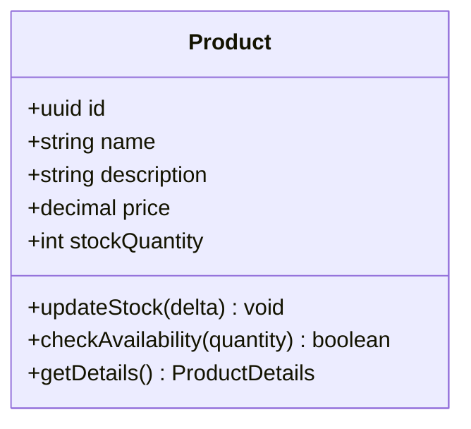
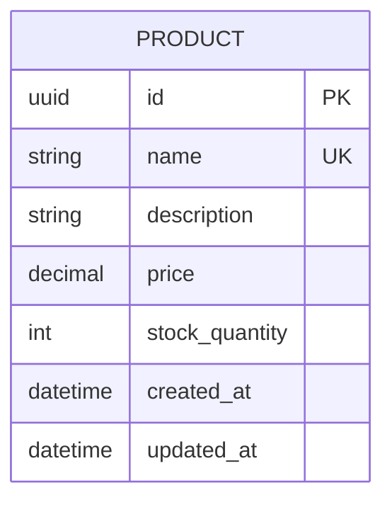
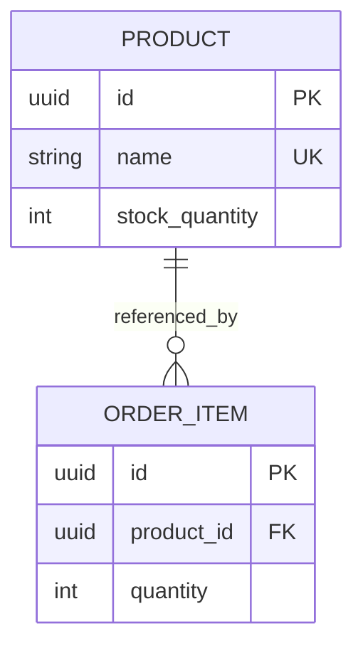
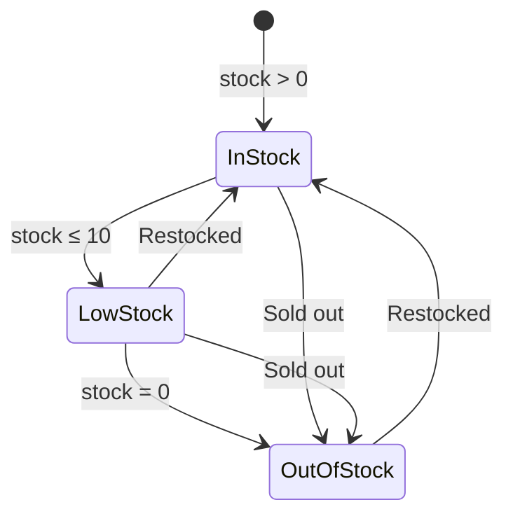

# Product Entity

The Product entity represents an item available for purchase in the catalog.

## Business Logic

A product:
- Has a unique identity (UUID)
- Has a name, description, and price
- Tracks available stock quantity
- Can be referenced by multiple order items
- Supports inventory updates

## Class Diagram



## Database Schema



## Fields

| Field | Type | Constraints | Description |
|-------|------|-------------|-------------|
| `id` | uuid | PK | Unique product identifier |
| `name` | string | UNIQUE, NOT NULL | Product name |
| `description` | text | NULLABLE | Product description |
| `price` | decimal(10,2) | NOT NULL, > 0 | Current price |
| `stock_quantity` | int | NOT NULL, ≥ 0 | Available inventory |
| `created_at` | datetime | NOT NULL | When product was added |
| `updated_at` | datetime | NOT NULL | Last modification time |

## Relationships

- **Referenced by [OrderItems](order-item.md)** (1 product : many order items)



## Business Rules

### Stock Management
- Stock quantity cannot go below 0
- Stock updates must be atomic (transaction-safe)
- Concurrent orders must not oversell (row-level locking)

### Pricing
- Price must be > 0
- Price changes affect future orders only (existing orders retain original price)
- Price history should be tracked (not shown in simplified schema)

### Product Lifecycle
- Products can be marked as "inactive" but not deleted (preserve order history)
- Inactive products don't appear in catalog but remain in database
- Reactivation supported with stock replenishment

## Stock States



## Methods

### `updateStock(delta: int): void`
Updates the stock quantity by the given delta (positive for restock, negative for sale).

**Validation:**
- Resulting stock must be ≥ 0
- Must use database-level locking to prevent race conditions

**Example:**
```typescript
// Reduce stock when order is placed
await product.updateStock(-3);

// Restock when inventory arrives
await product.updateStock(100);
```

### `checkAvailability(quantity: int): boolean`
Checks if the requested quantity is available.

**Returns:** `true` if stock_quantity ≥ quantity, else `false`

**Example:**
```typescript
if (await product.checkAvailability(5)) {
    // Proceed with order
}
```

### `getDetails(): ProductDetails`
Retrieves full product details including pricing and availability.

## Concurrency Handling

### Pessimistic Locking (Recommended)
```sql
BEGIN TRANSACTION;

SELECT stock_quantity FROM products 
WHERE id = $1 
FOR UPDATE;  -- Lock row

-- Check if sufficient stock
-- Update stock
-- Create order item

COMMIT;
```

### Optimistic Locking (Alternative)
Use version column to detect concurrent modifications:

```sql
UPDATE products 
SET stock_quantity = stock_quantity - $2,
    version = version + 1
WHERE id = $1 
  AND version = $3  -- Check version hasn't changed
  AND stock_quantity >= $2;
```

## API Endpoints

- `GET /products` — List all active products
- `GET /products/{id}` — Retrieve product details
- `POST /products` — Create new product (admin)
- `PATCH /products/{id}` — Update product (admin)
- `PATCH /products/{id}/stock` — Update stock quantity (admin)
- `DELETE /products/{id}` — Mark product as inactive (admin)

## Related Flows

- [Create Order Flow](../flows/create-order.md) — Checks and reduces stock
- [Inventory Management Flow](../flows/inventory-management.md) — Stock tracking and updates

## Related Requirements

- **FR-010:** Track stock levels ([Requirements](../../requirements.md))
- **FR-011:** Prevent overselling ([Requirements](../../requirements.md))
- **FR-012:** Atomic inventory updates ([Requirements](../../requirements.md))

## Related User Stories

- [Place Order](../../user-stories/story-002-place-order.md)
- [Manage Inventory](../../user-stories/story-004-manage-inventory.md)

## Example Data

| id | name | description | price | stock_quantity |
|----|------|-------------|-------|----------------|
| uuid-1 | Laptop | 15" Pro Laptop | 1299.99 | 25 |
| uuid-2 | Mouse | Wireless Mouse | 29.99 | 150 |
| uuid-3 | Keyboard | Mechanical Keyboard | 89.99 | 0 |

---

**Related Entities:**
- [OrderItem](order-item.md) — Orders referencing this product
- [Order](order.md) — Orders containing this product (via OrderItem)

