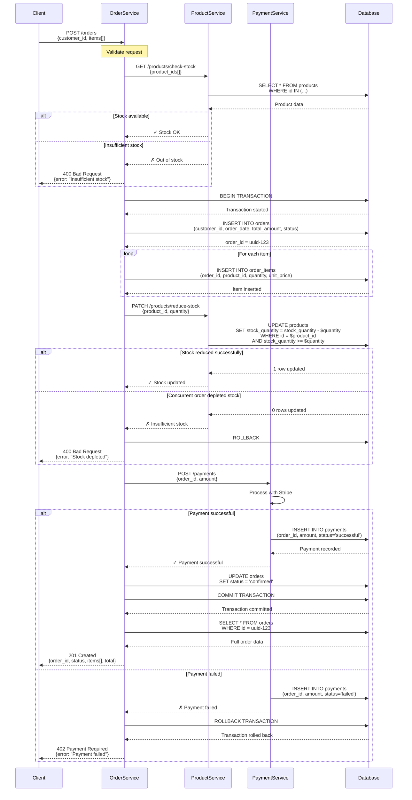

# Create Order Flow

This flow describes how customers create orders in the system.

## Overview

When a customer places an order:
1. Client sends order request with customer ID and items
2. System validates customer exists and products are in stock
3. System creates order and order items in a transaction
4. System reduces product inventory atomically
5. System initiates payment processing
6. System commits transaction and returns order confirmation

## Sequence Diagram



## Step-by-Step Description

### 1. Validate Request
- Ensure customer_id exists
- Ensure items array is not empty
- Validate each item has product_id, quantity

### 2. Check Stock Availability
- Query all products in the order
- Verify each product has sufficient stock
- Return error immediately if any product is out of stock

### 3. Begin Database Transaction
- Start ACID transaction to ensure atomicity
- All subsequent operations are part of this transaction

### 4. Create Order Record
- Insert order with status "pending"
- Calculate total_amount from items
- Record order_date timestamp

### 5. Create Order Items
- Insert one record per item
- Capture current unit_price (may differ from current product price)
- Link each item to the order

### 6. Reduce Product Stock
- Update stock_quantity atomically
- Use WHERE clause to ensure sufficient stock still exists
- Handle race conditions with concurrent orders

### 7. Process Payment
- Create payment record
- Call external payment gateway (Stripe)
- Record gateway_transaction_id

### 8. Finalize Order
- If payment successful:
  - Update order status to "confirmed"
  - Commit transaction
  - Return order confirmation
- If payment failed:
  - Rollback entire transaction
  - Restore inventory
  - Return payment error

## Error Handling

### Insufficient Stock (Before Transaction)
```json
{
  "error": "Insufficient stock",
  "details": [
    {
      "product_id": "uuid-abc",
      "product_name": "Laptop",
      "requested": 5,
      "available": 2
    }
  ]
}
```

**Response:** `400 Bad Request`

### Stock Depleted During Transaction
Race condition where another order consumed stock while this order was processing.

**Resolution:**
- Rollback transaction
- Restore all changes
- Return error to client
- Client can retry

**Response:** `400 Bad Request`

### Payment Failure
```json
{
  "error": "Payment failed",
  "reason": "Insufficient funds",
  "order_id": "uuid-123",
  "retry_allowed": true
}
```

**Response:** `402 Payment Required`

**Resolution:**
- Transaction rolled back
- Inventory restored
- Customer can retry with different payment method

### Database Timeout
- Transaction automatically rolled back
- Client receives `503 Service Unavailable`
- Client should retry after delay

## Concurrency Control

### Preventing Overselling

Use database row-level locking:

```sql
UPDATE products
SET stock_quantity = stock_quantity - $1
WHERE id = $2
  AND stock_quantity >= $1;  -- Atomic check-and-update
```

If `UPDATE` returns 0 rows, stock was insufficient.

### Alternative: Pessimistic Locking

```sql
BEGIN TRANSACTION;

SELECT stock_quantity 
FROM products 
WHERE id = $1 
FOR UPDATE;  -- Lock row until transaction completes

-- Check stock manually
-- Update if sufficient
-- Create order item

COMMIT;
```

## Performance Considerations

### Database Indexes
```sql
CREATE INDEX idx_products_id ON products(id);
CREATE INDEX idx_order_items_order_id ON order_items(order_id);
CREATE INDEX idx_orders_customer_id ON orders(customer_id);
```

### Response Time Targets
- Stock check: < 100ms
- Order creation: < 500ms
- Payment processing: < 2s
- Total end-to-end: < 3s (p99)

### Optimization Strategies
- Batch stock checks in single query
- Use connection pooling for database
- Cache product data (invalidate on stock updates)
- Async payment confirmation (optional)

## Related Entities

- [Customer](../domain/customer.md) — Places the order
- [Order](../domain/order.md) — Entity created by this flow
- [OrderItem](../domain/order-item.md) — Items added to order
- [Product](../domain/product.md) — Stock checked and updated
- [Payment](../domain/payment.md) — Payment processed

## Related Flows

- [Payment Processing Flow](payment-processing.md) — Detailed payment steps
- [Inventory Management Flow](inventory-management.md) — Stock tracking

## Related Requirements

- **FR-004:** Place orders ([Requirements](../../requirements.md))
- **FR-011:** Prevent overselling ([Requirements](../../requirements.md))
- **FR-012:** Atomic inventory updates ([Requirements](../../requirements.md))
- **NFR-001:** Order creation performance ([Requirements](../../requirements.md))
- **NFR-006:** ACID transactions ([Requirements](../../requirements.md))

## Related User Stories

- [Place Order](../../user-stories/story-002-place-order.md)

## Testing Scenarios

### Happy Path
1. Customer has valid account
2. All products in stock
3. Payment successful
4. Order confirmed

### Concurrent Orders
1. Two customers order same product simultaneously
2. Only sufficient stock for one order
3. First order succeeds
4. Second order fails with "insufficient stock"

### Payment Failure
1. Order created successfully
2. Payment fails (insufficient funds)
3. Transaction rolled back
4. Inventory restored
5. Customer can retry

---

**Next:** See [Payment Processing Flow](payment-processing.md) for detailed payment handling.

