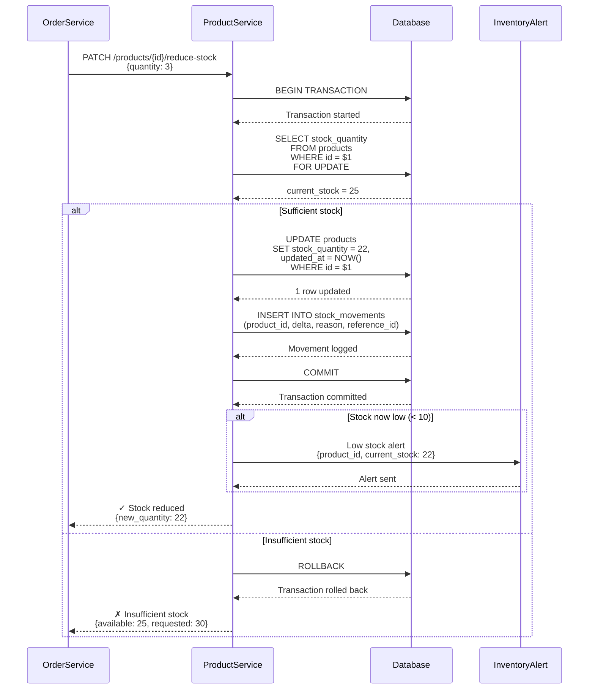
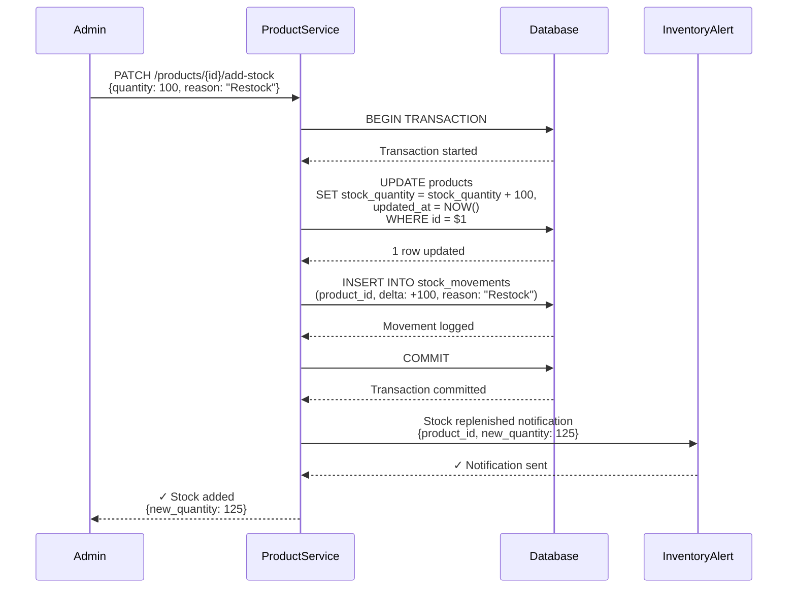
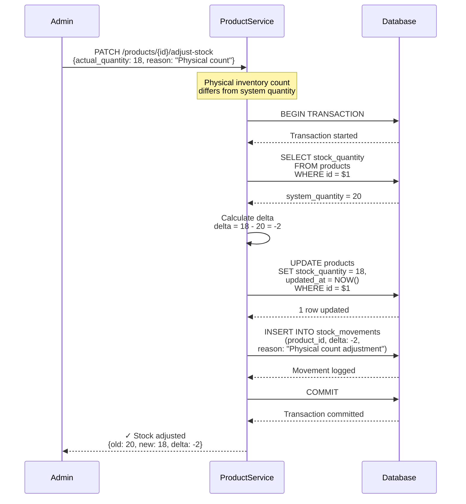
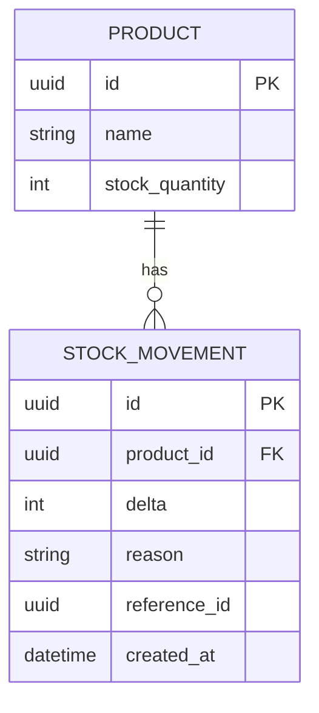
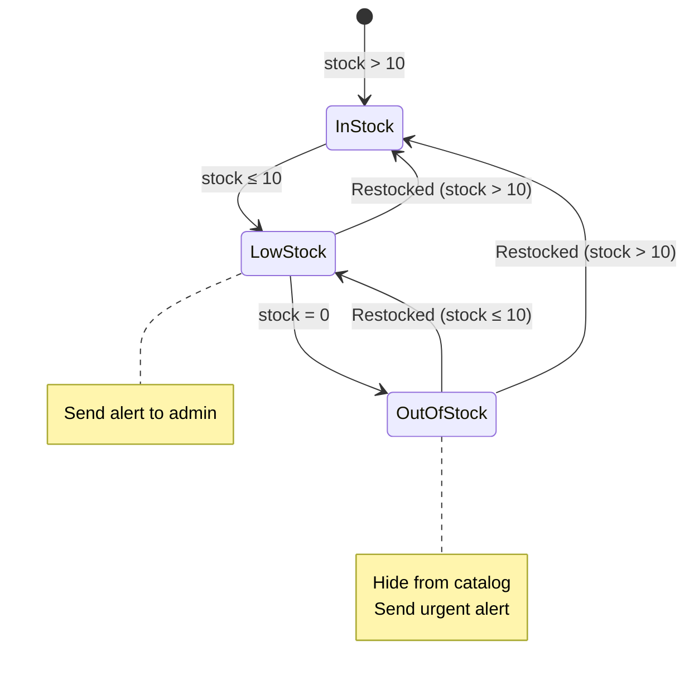
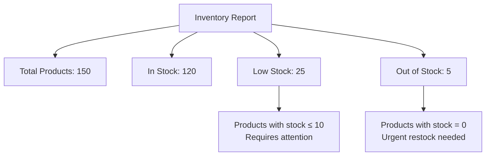
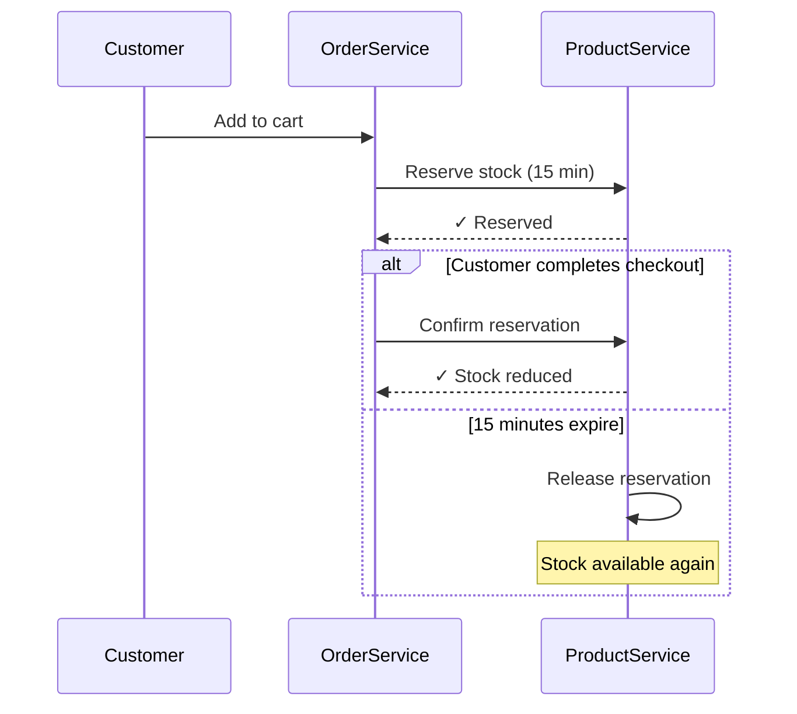

# Inventory Management Flow

This flow describes how product inventory is tracked and updated across the system.

## Overview

Inventory management ensures:
- Real-time stock tracking
- Prevention of overselling
- Atomic stock updates with orders
- Inventory replenishment workflows

## Actors

- **Order Service** — Reduces stock when orders are placed
- **Product Service** — Manages product catalog and stock levels
- **Admin Users** — Restock inventory and adjust quantities
- **Inventory Service** (optional) — Dedicated service for complex inventory operations

## Stock Update Flow (Order Placement)



## Stock Replenishment Flow



## Inventory Audit Flow



## Stock Movement Tracking

All stock changes are logged in a `stock_movements` table for audit trail:



### Stock Movement Reasons

| Reason | Delta | Description |
|--------|-------|-------------|
| `order_placed` | Negative | Stock reduced for order |
| `order_cancelled` | Positive | Stock restored after cancellation |
| `restock` | Positive | New inventory received |
| `adjustment` | +/- | Physical count correction |
| `damage` | Negative | Damaged goods removed |
| `return` | Positive | Customer return |

## Concurrency Control

### Pessimistic Locking (Recommended)

```sql
BEGIN TRANSACTION;

-- Lock the product row
SELECT stock_quantity 
FROM products 
WHERE id = $1 
FOR UPDATE;

-- Check if sufficient stock
IF stock_quantity >= $requested_quantity THEN
    UPDATE products 
    SET stock_quantity = stock_quantity - $requested_quantity
    WHERE id = $1;
    
    INSERT INTO stock_movements (product_id, delta, reason)
    VALUES ($1, -$requested_quantity, 'order_placed');
    
    COMMIT;
ELSE
    ROLLBACK;
    RETURN 'Insufficient stock';
END IF;
```

### Benefits
- Prevents race conditions
- Guarantees no overselling
- Simple to reason about

### Trade-offs
- Row is locked during transaction
- Reduces concurrency for popular products
- Acceptable for most e-commerce scenarios

## Low Stock Alerts



### Alert Thresholds
- **Low Stock:** stock_quantity ≤ 10 → Email admin
- **Out of Stock:** stock_quantity = 0 → Urgent notification + hide from catalog
- **Restocked:** stock_quantity increases → Confirm notification

## Inventory Report Example



## Business Rules

### Minimum Stock Levels
- Products should maintain minimum 10 units (safety stock)
- Alert sent when stock falls below threshold
- Automatic reorder system (future enhancement)

### Maximum Stock Levels
- No hard limit on stock_quantity
- Consider warehouse capacity in practice
- Monitor slow-moving inventory (>90 days without sale)

### Stock Reservations (Advanced)
For high-demand products, consider temporary reservations:



## Error Handling

### Negative Stock Attempt
```sql
UPDATE products
SET stock_quantity = stock_quantity - $1
WHERE id = $2
  AND stock_quantity >= $1;  -- Prevents negative stock
```

If UPDATE affects 0 rows, insufficient stock.

### Concurrent Updates
Database transaction isolation ensures:
- One order at a time can modify a product's stock
- Serializable operations
- No lost updates

### Stale Data
- Use optimistic locking with version column (alternative approach)
- Refresh stock data before display
- Cache invalidation on stock updates

## Performance Optimization

### Caching Strategy
```
Product stock (high-traffic products):
- Cache TTL: 5 seconds
- Invalidate on stock update
- Acceptable slight staleness for read-heavy operations
```

### Database Indexes
```sql
CREATE INDEX idx_products_stock ON products(stock_quantity) 
WHERE stock_quantity <= 10;  -- Partial index for low-stock queries

CREATE INDEX idx_stock_movements_product ON stock_movements(product_id, created_at DESC);
```

### Monitoring Queries
```sql
-- Low stock products
SELECT id, name, stock_quantity 
FROM products 
WHERE stock_quantity <= 10 
ORDER BY stock_quantity ASC;

-- Out of stock products
SELECT id, name 
FROM products 
WHERE stock_quantity = 0;

-- Stock movement history for product
SELECT * 
FROM stock_movements 
WHERE product_id = $1 
ORDER BY created_at DESC 
LIMIT 50;
```

## Related Entities

- [Product](../domain/product.md) — Products with tracked inventory
- [Order](../domain/order.md) — Orders that reduce stock
- [OrderItem](../domain/order-item.md) — Items that reference products

## Related Flows

- [Create Order Flow](create-order.md) — Reduces stock when order is placed

## Related Requirements

- **FR-010:** Track stock levels ([Requirements](../../requirements.md))
- **FR-011:** Prevent overselling ([Requirements](../../requirements.md))
- **FR-012:** Atomic inventory updates ([Requirements](../../requirements.md))

## Related User Stories

- [Manage Inventory](../../user-stories/story-004-manage-inventory.md)
- [Place Order](../../user-stories/story-002-place-order.md)

## Testing Scenarios

### Concurrent Stock Reduction
1. Two orders placed simultaneously for same product
2. Product has stock = 5
3. Each order requests 3 units
4. First order succeeds (stock → 2)
5. Second order fails (insufficient stock)

### Stock Movement Audit
1. Product starts with stock = 100
2. Order placed: -5 (stock = 95)
3. Order cancelled: +5 (stock = 100)
4. Restock: +50 (stock = 150)
5. Physical count adjustment: -2 (stock = 148)
6. All movements logged in stock_movements table

---

**Related:** See [Create Order Flow](create-order.md) for how inventory updates fit into order creation.

