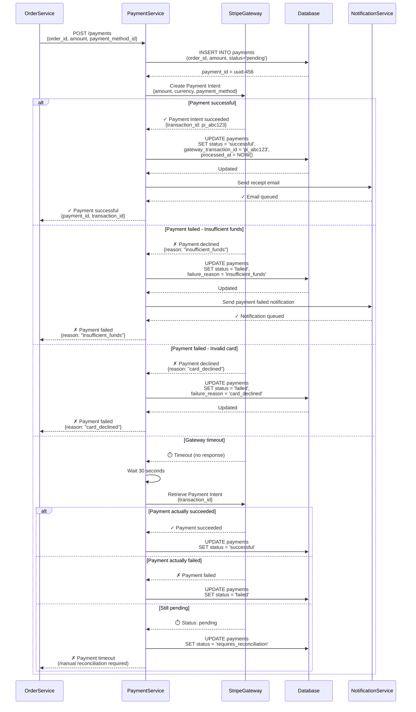
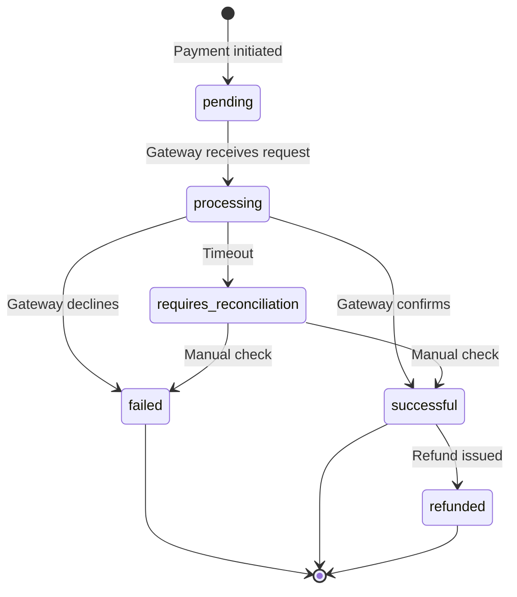
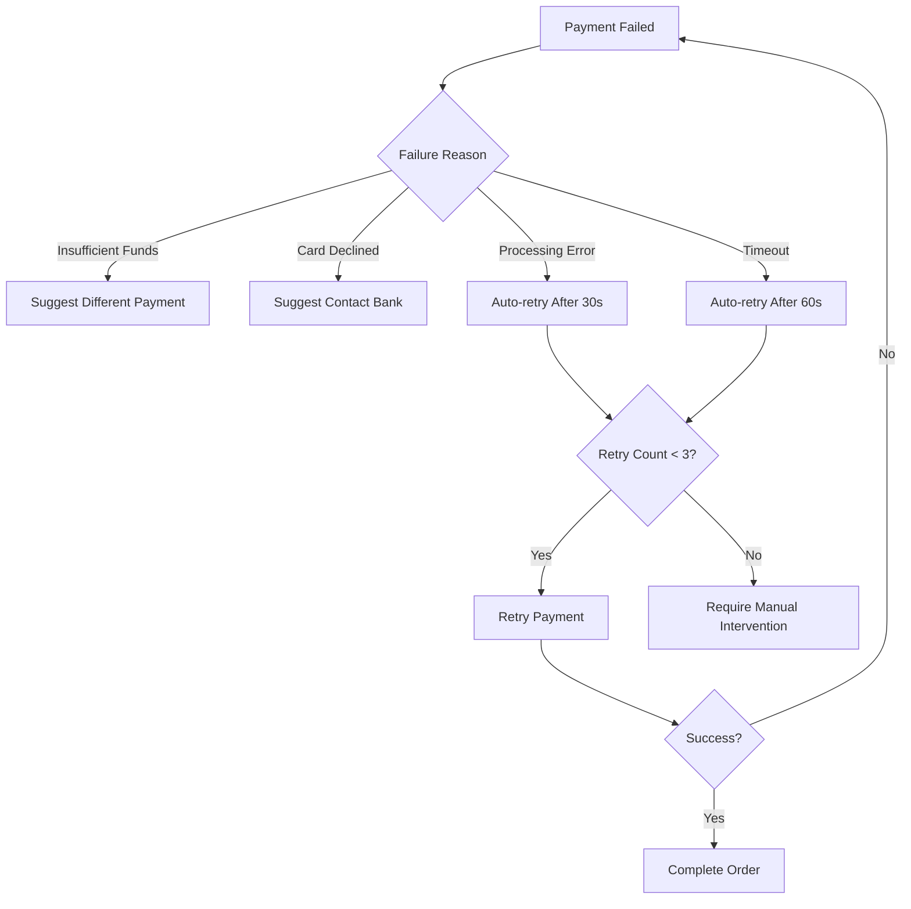
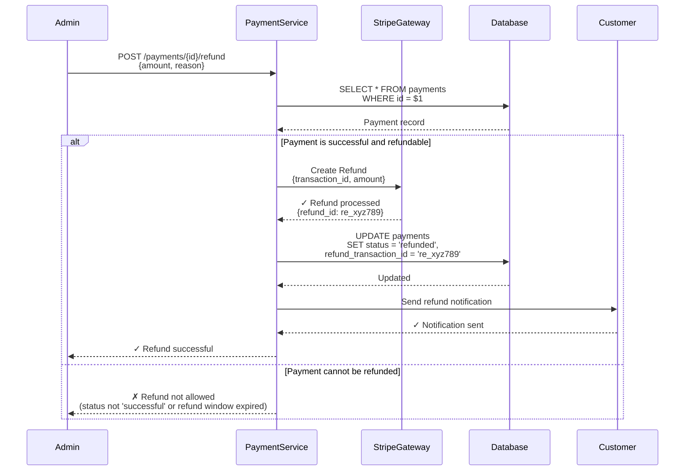

# Payment Processing Flow

This flow describes how payments are processed for orders.

## Overview

Payment processing integrates with external payment gateways (e.g., Stripe) to handle customer payments securely. The flow ensures PCI-DSS compliance and handles various payment scenarios.

## Sequence Diagram



## Step-by-Step Description

### 1. Create Payment Record
- Insert payment with status "pending"
- Record order_id and amount
- Generate unique payment_id

### 2. Call Payment Gateway
- Use Stripe Payment Intents API
- Pass amount, currency, and payment method
- Include metadata (order_id) for reconciliation

### 3. Handle Gateway Response

#### Success Path
- Update payment status to "successful"
- Record gateway_transaction_id
- Set processed_at timestamp
- Trigger receipt email
- Return success to OrderService

#### Failure Path
- Update payment status to "failed"
- Record failure_reason
- Trigger notification to customer
- Return failure to OrderService
- Allow retry with different payment method

#### Timeout Path
- Wait and query payment status
- Reconcile final status
- Handle edge cases (pending, unknown)

## Payment States



## Error Handling

### Common Failure Reasons

| Reason | Description | Customer Action |
|--------|-------------|-----------------|
| `insufficient_funds` | Not enough balance | Use different payment method |
| `card_declined` | Card rejected by issuer | Contact bank or use different card |
| `expired_card` | Card past expiration | Update payment method |
| `incorrect_cvc` | Wrong CVV/CVC code | Re-enter correct CVV |
| `processing_error` | Gateway internal error | Retry after few minutes |

### Retry Strategy



### Retry Limits
- Maximum 3 automatic retries for timeouts/processing errors
- No automatic retries for customer-actionable errors (insufficient funds, card declined)
- 30s delay between retries (exponential backoff)

## Idempotency

Payment operations must be idempotent to handle retries safely.

### Idempotency Key
Use order_id + payment_attempt_number as idempotency key:

```typescript
const idempotencyKey = `${orderId}_${attemptNumber}`;

const paymentIntent = await stripe.paymentIntents.create({
    amount: amount * 100,
    currency: 'usd',
    metadata: { order_id: orderId }
}, {
    idempotencyKey: idempotencyKey
});
```

### Prevents Double Charging
- Same idempotency key returns existing payment intent
- No duplicate charges even if request is retried
- Critical for network failures and client retries

## Security Considerations

### PCI-DSS Compliance
- Never store raw credit card numbers in our database
- Use Stripe's tokenization (payment_method_id)
- All payment data encrypted in transit (HTTPS/TLS)
- Payment gateway handles sensitive data

### Fraud Prevention
- Validate customer IP address
- Check velocity (max 3 failed attempts per hour)
- Use Address Verification System (AVS)
- Require CVV validation
- Flag suspicious patterns (high-value orders from new accounts)

### Authentication
- Require JWT authentication for payment endpoints
- Verify customer owns the order being paid
- Log all payment attempts for audit trail

## Refund Processing



### Refund Rules
- Only "successful" payments can be refunded
- Full or partial refunds supported
- Refund window: 30 days from payment date
- Refunds take 5-10 business days to appear in customer account

## Monitoring and Alerting

### Key Metrics
- **Payment Success Rate:** Target > 95%
- **Payment Processing Time:** Target < 2s (p99)
- **Gateway Timeout Rate:** Target < 0.1%
- **Refund Rate:** Monitor for unusual spikes

### Alerts
- Payment success rate drops below 90% → Page on-call engineer
- Gateway timeout rate > 1% → Investigate gateway health
- Unusual refund volume → Potential fraud or quality issue

## Related Entities

- [Order](../domain/order.md) — Order being paid for
- [Payment](../domain/payment.md) — Payment entity
- [Customer](../domain/customer.md) — Customer making payment

## Related Flows

- [Create Order Flow](create-order.md) — Initiates payment processing

## Related Requirements

- **FR-007:** Payment validation ([Requirements](../../requirements.md))
- **FR-008:** Payment failure handling ([Requirements](../../requirements.md))
- **FR-009:** Receipt generation ([Requirements](../../requirements.md))
- **NFR-003:** Payment processing time ([Requirements](../../requirements.md))
- **NFR-011:** PCI-DSS compliance ([Requirements](../../requirements.md))

## Related User Stories

- [Place Order](../../user-stories/story-002-place-order.md)
- [Refund Order](../../user-stories/story-005-refund-order.md)

## Testing Scenarios

### Happy Path
1. Valid payment method
2. Sufficient funds
3. Payment succeeds immediately
4. Receipt sent

### Card Declined
1. Payment method declined by issuer
2. Customer notified
3. Retry with different card succeeds

### Gateway Timeout
1. Gateway doesn't respond
2. System waits 30s
3. Queries payment status
4. Reconciles final state

### Concurrent Payment Attempts
1. Customer clicks "Pay" multiple times
2. Idempotency key prevents duplicate charges
3. All requests return same payment intent

---

**Related:** See [Create Order Flow](create-order.md) for how payment fits into order creation.

