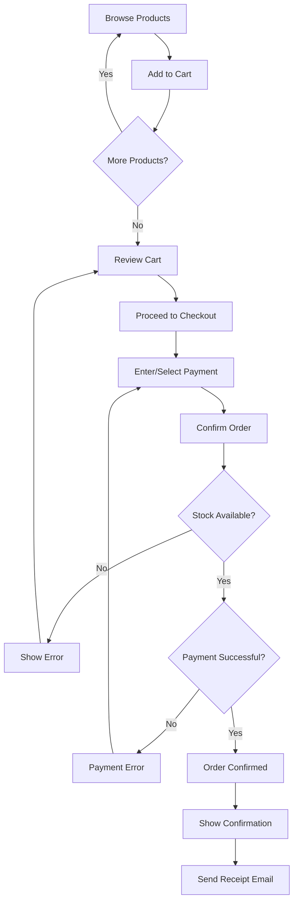

# User Story: Place Order

**ID:** STORY-002

**Status:** Planned

**Priority:** High

---

## User Story Statement

As a **customer**, I want to **place an order with multiple products**, so that I can **purchase items from the store**.

---

## Acceptance Criteria

- [ ] Customer can select multiple products and quantities
- [ ] System validates that products are in stock before proceeding
- [ ] System calculates order total with correct pricing
- [ ] Customer can review order summary before confirming
- [ ] Customer can select or add a payment method
- [ ] System processes payment securely via Stripe
- [ ] Customer receives order confirmation with order ID
- [ ] Order appears in customer's order history
- [ ] Inventory is reduced atomically with order confirmation
- [ ] Email receipt is sent to customer

---

## Related Entities

- [Customer](../architecture/domain/customer.md) — Places the order
- [Order](../architecture/domain/order.md) — Order entity created
- [OrderItem](../architecture/domain/order-item.md) — Items in the order
- [Product](../architecture/domain/product.md) — Products being ordered
- [Payment](../architecture/domain/payment.md) — Payment for the order

---

## Related Flows

- [Create Order Flow](../architecture/flows/create-order.md) — Complete order creation process
- [Payment Processing Flow](../architecture/flows/payment-processing.md) — Payment handling
- [Inventory Management Flow](../architecture/flows/inventory-management.md) — Stock updates

---

## Related Requirements

- **FR-004:** Place orders with multiple items ([Requirements](../requirements.md))
- **FR-011:** Prevent overselling ([Requirements](../requirements.md))
- **FR-012:** Atomic inventory updates ([Requirements](../requirements.md))
- **NFR-001:** Order creation performance < 2s ([Requirements](../requirements.md))
- **NFR-006:** ACID transactions ([Requirements](../requirements.md))

---

## API Endpoints

### `POST /orders`

**Request:**
```json
{
  "customer_id": "550e8400-e29b-41d4-a716-446655440000",
  "items": [
    {
      "product_id": "abc-123",
      "quantity": 2
    },
    {
      "product_id": "def-456",
      "quantity": 1
    }
  ],
  "payment_method_id": "pm_xyz789"
}
```

**Response (Success):**
```json
{
  "order_id": "order-123",
  "status": "confirmed",
  "items": [
    {
      "product_id": "abc-123",
      "product_name": "Laptop",
      "quantity": 2,
      "unit_price": 1299.99,
      "line_total": 2599.98
    },
    {
      "product_id": "def-456",
      "product_name": "Mouse",
      "quantity": 1,
      "unit_price": 29.99,
      "line_total": 29.99
    }
  ],
  "total_amount": 2629.97,
  "order_date": "2026-01-12T10:30:00Z"
}
```

**Response (Error - Insufficient Stock):**
```json
{
  "error": "Insufficient stock",
  "details": [
    {
      "product_id": "abc-123",
      "product_name": "Laptop",
      "requested": 5,
      "available": 2
    }
  ]
}
```

---

## Acceptance Tests

```gherkin
Feature: Place Order

  Scenario: Customer places order successfully
    Given I am logged in as a customer
    And product "Laptop" has stock of 10
    And product "Mouse" has stock of 50
    When I add "Laptop" (qty=2) to my order
    And I add "Mouse" (qty=1) to my order
    And I provide valid payment information
    And I confirm the order
    Then order is created successfully
    And order status is "confirmed"
    And I receive order confirmation email
    And "Laptop" stock is reduced by 2
    And "Mouse" stock is reduced by 1
    And order appears in my order history

  Scenario: Order fails with insufficient stock
    Given I am logged in as a customer
    And product "Laptop" has stock of 1
    When I try to order "Laptop" (qty=5)
    Then I see error "Insufficient stock"
    And error shows "requested: 5, available: 1"
    And no order is created
    And stock is not reduced

  Scenario: Order fails with payment declined
    Given I am logged in as a customer
    And product "Laptop" is in stock
    When I add "Laptop" to my order
    And I provide payment method with insufficient funds
    And I confirm the order
    Then I see error "Payment failed: Insufficient funds"
    And no order is created
    And stock is not reduced

  Scenario: Concurrent orders for same product
    Given product "Laptop" has stock of 3
    When Customer A orders "Laptop" (qty=2) at 10:00:00.000
    And Customer B orders "Laptop" (qty=2) at 10:00:00.001
    Then Customer A's order succeeds
    And stock is reduced to 1
    And Customer B's order fails with "Insufficient stock"
```

---

## Business Rules

### Order Validation
- Customer must be logged in and verified
- Order must contain at least 1 item
- All products must exist and be active
- All products must have sufficient stock

### Pricing
- Unit price captured at order time (immune to price changes)
- Total calculated as Σ(quantity × unit_price)
- Tax calculation (future enhancement)

### Payment
- Payment must succeed before order is confirmed
- Payment failure triggers full rollback
- Customer can retry with different payment method
- Maximum 3 payment attempts per order

### Inventory
- Stock reduced atomically with order confirmation
- Concurrent orders handled with row-level locking
- No overselling allowed

---

## User Flow



---

## UI Mockup Notes

### Cart Page
- List of items with quantity controls
- Price per item and line totals
- Grand total
- "Proceed to Checkout" button

### Checkout Page
- Order summary (read-only)
- Payment method selection
- "Place Order" button
- Terms and conditions checkbox

### Confirmation Page
- Order ID prominently displayed
- Order summary
- Estimated delivery date
- Link to order tracking
- "Continue Shopping" button

---

## Performance Targets

- Order creation (end-to-end): < 2 seconds (p99)
- Stock validation: < 100ms
- Payment processing: < 2 seconds
- Database transaction: < 500ms

---

## Definition of Done

- [ ] API endpoints implemented and tested
- [ ] Unit tests written (≥80% coverage)
- [ ] Integration tests pass
- [ ] Concurrency tests pass (prevent overselling)
- [ ] Payment integration working (Stripe)
- [ ] Email notifications working
- [ ] UI implemented and responsive
- [ ] Performance benchmarks met
- [ ] Security review completed
- [ ] Load testing completed (1,000 concurrent users)
- [ ] Documentation updated
- [ ] Deployed to staging and verified

---

## Technical Notes

### Transaction Handling

```typescript
async function createOrder(customerId: uuid, items: OrderItem[], paymentMethodId: string) {
    const transaction = await db.beginTransaction();
    
    try {
        // 1. Validate stock
        const stockCheck = await validateStock(items);
        if (!stockCheck.valid) {
            throw new InsufficientStockError(stockCheck.details);
        }
        
        // 2. Create order
        const order = await db.insert('orders', {
            id: uuidv4(),
            customer_id: customerId,
            total_amount: calculateTotal(items),
            status: 'pending'
        });
        
        // 3. Create order items
        for (const item of items) {
            await db.insert('order_items', {
                order_id: order.id,
                product_id: item.product_id,
                quantity: item.quantity,
                unit_price: item.unit_price
            });
        }
        
        // 4. Reduce stock
        await reduceStock(items);
        
        // 5. Process payment
        const payment = await processPayment(order.id, order.total_amount, paymentMethodId);
        
        if (payment.status === 'successful') {
            // 6. Confirm order
            await db.update('orders', { status: 'confirmed' }, { id: order.id });
            await transaction.commit();
            
            // 7. Send notifications (async)
            await sendOrderConfirmation(order.id);
            
            return order;
        } else {
            throw new PaymentFailedError(payment.reason);
        }
    } catch (error) {
        await transaction.rollback();
        throw error;
    }
}
```

---

## Open Questions

- **Q:** Should we support guest checkout (no account required)?
  - **A:** No, defer to v2. Require account for v1.

- **Q:** What if payment gateway times out?
  - **A:** Retry once after 30s, then manual reconciliation

- **Q:** Should we support order editing after placement?
  - **A:** No, cancel and reorder instead

---

## Related User Stories

- [Customer Registration](story-001-customer-registration.md) — Prerequisite
- [Track Order Status](story-003-track-order.md) — Follow-up
- [Refund Order](story-005-refund-order.md) — Cancellation flow

---

**Next:** See [Track Order Status](story-003-track-order.md) for order tracking.

